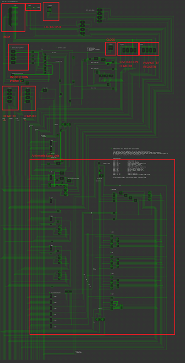
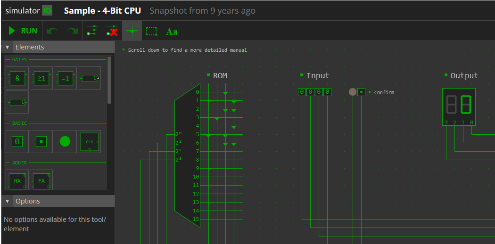

[session2](../../session2/) | [Boolean Algebra And Logic Gates](../docs/booleanAlgebraAndLogicGates.md)

# Boolean Algebra And Logic Gates
This section provides a simple summary of logic gates showing how they can be put together to form complex circuits.
Several on line simulations are pointed to.
Change the input or modify these simulations to see if you can better understand ho they work.

## Simple logic gates

Simple logic gates are the building blocks of computers.

Although we do not need to go into the details of circuit design, you can see simulations here of a

[CMOS (Complementary Netal Oxide Silicon) implemented NAND Gate](https://www.falstad.com/circuit/e-cmosnand.html) 

and a [TTL (Transistor Transistor Logic] implemented NAND Gate](https://www.falstad.com/circuit/e-ttlnand.html)

The operation of a number of basic gates are illustrated in the 
[Basic AND OR XOR and NOT gates simulation](https://simulator.io/board/jBA0DN5HQz/3)

### AND gate
AND Gate - if all inputs are 1 the output is 1, otherwise the output is 0

| input A | Input B | Output |
|---------|---------|--------|
| 0       | 0       | 0      |
| 0       | 1       | 0      |
| 1       | 0       | 0      |
| 1       | 1       | 1      |

### OR gate 
OR gate. The output of an OR gate is logical "1" if any of the inputs are "1". The output is "low" (0) only if all inputs are "low" 

| input A | Input B | Output |
|---------|---------|--------|
| 0       | 0       | 0      |
| 0       | 1       | 1      |
| 1       | 0       | 1      |
| 1       | 1       | 1      |

### NOT (inverter) gate
NOT (inverter) gate - the output is opposite of the input.

| input A | Output |
|---------|--------|
| 0       | 1      |
| 1       | 0      |

### XOR GATE
XOR Stands for "Exclusive-OR" and outputs a high logical "1" when the two input values differ.

| input A | Input B | Output |
|---------|---------|--------|
| 0       | 0       | 0      |
| 0       | 1       | 1      |
| 1       | 0       | 1      |
| 1       | 1       | 0      |


### NAND Gate
NAND Stands for NOT AND - an AND gate followed by a NOT gate.
Outputs a low logical "0" when both inputs are logical "1"

| input A | Input B | Output |
|---------|---------|--------|
| 0       | 0       | 1      |
| 0       | 1       | 0      |
| 1       | 0       | 0      |
| 1       | 1       | 0      |

Simple logic gates can be put together to form complex circuits as illustrated in the following sections.
In practice, there are many ways to implement logic circuits and all of these circuit examples could also be constructed using just AND and NOT gates as a starting point. 

## Adders

Previously we saw how boolean addition is performed in [Binary Arithmetic](../docs/binaryArithmetic.md). 

A Half Adder can perform one stage of addition, adding 2 bits and producing a carry bit if needed.

[Half Adder simulation using XOR and AND gates](https://simulator.io/board/A0MeGe4pvm/1)

A Full Adder can add 3 bits, which allows it to also include the carry bit from the previous stage.

[Full Adder simulation using XOR, OR and AND gates](https://simulator.io/board/CZ0EsxYPgm/1)

We can combine half and full adders to create an adder which can add multiple bits.

[4 bit adder using half adders](https://simulator.io/board/JIxRlrtGhm/1)

Change the inputs to see how the output represents the sum of two binary numbers.

## Flip Flops and Registers

Flip-Flops are small circuits which store a state of 1 or 0.

See this [simulation showing how a JK Flip Flop is constructed from NAND gates](https://www.falstad.com/circuit/e-jkff.html)

Flip-Flops can be strung together to create counters which count the number of times an input has changed from from 0 to 1 to 0. 

See this [simulation showing how a 4 bit counter can be constructed from J K Flip-Flops](https://www.falstad.com/circuit/e-counter.html)

This could be used for instance to construct a Program Counter which sequentially moves the CPU through a program in memory.

Flip-Flops can also be used to construct registers which store a sequence of bits (such as a byte).
Thus Flip-Flops can be used to create static RAM memory.

See this [4 bit register](https://simulator.io/board/ueB4QsoQGV/1)

## Putting it all together : Creating a simple CPU From counters, adders and registers.

Having looked at the basic components, lets look at how these can be put together to create a simple 4 bit CPU simulation.
You may remember that the first Intel CPU was a 4004 4 bit microprocessor. [4 bit computing](https://en.wikipedia.org/wiki/4-bit_computing) is now mostly obsolete but still useful for understanding how CPU's actually work.

This is a simulator of a [Sample 4-Bit-CPU, (Bastian Born build 2015)](https://simulator.io/board/AWZpw7Fy3I/2)

This is a screenshot of the simulator where the key components are highlighted.
  
 
   
  [Large full-Diagram CPU-4bit](../docs/images/CPU-4bit-SEGMENTS.png)
  
If you look at the model you can identify how flip-flops, gates, half-adders and registers are used to create the CPU.

### programming the 4 bit CPU

This machine has two Registers (A and B) and 12 instructions (OP Codes)


```
Instructions:

0x00  IN        reads input to A
0x01  OUT       writes A to display
0x02  MOV xx    loads intermediate number to A
0x03  SWP       swaps register A and B
0x04  ADD       adds B to A, saves in A
0x05  SUB       subtracts B from A, saves in A
0x06  AND       AND on A and B, saves in A
0x07  OR        OR on A and B, saves in A
0x08  XOR       XOR on A and B, saves in A
0x09  NOT       NOT on A
0x0A  JMP xx    jumps to address
0x0B  JZ  xx    jumps to address, if zero flag is set
```

A simple program is stored in the ROM.

 

If you run the simulation, you will see the OUTPUT COUNT 7 segment display incrementing as the processor adds.

Exercise - Try and decode the ROM to understand the instructions being run by the CPU

You can write your own program using the diode tool on the ROM (upper left corner).
On expected user input (instruction IN) the red light next to the input switches lights up,
to confirm your input press the confirm button once.

Exercise - See if you can modify the programming in the ROM, perhaps to count down instead of up.

You can see the [4 bit cpu programming answer](../docs/4bitCPUProgramAnswer.md) (DONT Look until you tried yourself)

### Further reading on 4 bit computing

[History of First microprocessor Intel 4004](https://www.intel.com/content/www/us/en/history/museum-story-of-intel-4004.html)

[Original INTEL 4004 schematics and design](https://datasheets.chipdb.org/Intel/MCS-4/4004_schematic.pdf)

See also [Nibbler](https://www.bigmessowires.com/nibbler/) which is a 4 bit CPU built from standard 7400 series logic chips – individual counters, registers, buffers, and gates. It’s an educational example of a simple CPU that’s easy to understand and build, but still capable of running games and other interesting programs.


### 16 Bit CPU

This is a similar example for a 16 bit processor. 

[logigator 16-Bit General Purpose CPU](https://logigator.com/en/community/project/8a738598-3e90-4be8-bd02-50e892f4c488)

[Some documentation can be found here:](https://docs.google.com/spreadsheets/d/1MG44B5RzTul4EMDJowlx4hgNE3XYFRoyR7EFi6A0o3M/edit?usp=sharing)

(Included for interest but I am not sure if it is complete or working). 

## Further reading on boolean logic

The following tutorials give more background on basic logic circuits and Flip-Flops

[Pádraig Ó Conbhuí Gates and Flip-Flops](https://www.maths.tcd.ie/~oconbhup/labs/Gates%20and%20Flip-Flops/Gates%20and%20Flip-Flops.pdf)

[nuts and volts - small logic gates the building blocks of digital circuits part 1](https://www.nutsvolts.com/magazine/article/small-logic-gates-spawn-big-dreams-part-1)

[nuts and volts - small logic gates the building blocks of digital circuits part 2](https://www.nutsvolts.com/magazine/article/small-logic-gates-spawn-big-dreams-part-2)

If you are unsure of Boolean Algebra there are a really good series of tutorials here

[Boolean Function Tutorials](https://www.electronics-tutorials.ws/boolean/bool_1.html)

[Boolean Algebra Tutorials](https://www.electronics-tutorials.ws/boolean)


