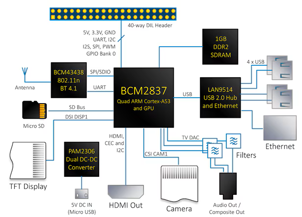

[Main Menu](../../sessions/README.md) | [session3](../session3/) 

# Session 3 - more architecture

In the last session session we explored how a CPU could be constructed using logic gates.

In this session we will zoom back out and look at how a computer like the Raspberry Pi communicates with the outside world.

The diagram below illustrates the peripherals architecture on a Pi.

   

At the heart of a Pi3 is a Broadacom BCM2837 chip.
This is referred to as a 'System on a Chip' because the single chip contains 4 CPU cores, a memory management unit, a  Graphics Processing unit (GPU) and multiple drivers for USB, Ethernet and General Purpose IO (GPIO) peripherals.

In this session we will look at the GPIO

The GPIO unit is connected to the 40 pin connector on the PI.

   
   
Internally, the GPIO lines are labelled GPIO 0 to GPIO 25.
(Note that the connector pin wiring to the internal GPIO lines does change slightly between Pi versions so you need to be careful which Pi you are using).

Each of the pins is programmable to have different functions which makes the GPIO capability extremely flexible. 
The simplest use case defines the pins as INPUTs or OUTPUTs but some of the pins can also be used as serial ports or clocks for external peripherals.

Programming the GPIO can be extremely complex but fortunately, many tools and libraries are available to make it easy for a user to use the GPIO pins without needing to understand the underlying complexity. 

In this session we will use an application called [Node RED](https://nodered.org/) and a Raspberry Pi library called [WiringPi](https://github.com/WiringPi/WiringPi) to manipulate the GPIO and control external LED lights. 

In later sessions we will look at programming the GPIO directly using Assembler Language and C.

## Experiments with IO on your raspberry PI.

We have seen that the Pi has a 40 pin connector to the GPIO. 
Many test kits and experimental modules are available which can use the Pi GPIO.
The [Gertboard](https://cpc.farnell.com/gertboard/gertboard/board-gertboard-assembled/dp/SC12828) is one such kit which makes it easier to try GPIO programming experiments. 

However it is also possible to work directly with the PI connector using some components and a simple `bread board`.
An external lecturer, Bob Potter has provided a guest lecture and simple traffic light example using discrete components and Node RED.

Node RED can also be used with the Gertboard.
(Bob's example Traffic light flow will work with the LEDs on the Gertboard as well as with  the discrete components).

To finish the session, we will configure the Gertboard and get it to work with the WiringPi library.

We will start with getting Node RED installed on the Pi.

Follow the instructions to install Node RED in [getting Node RED to work with your PI](../session3/docs/Node-Red-Intro.md).

Then do these [Simple Traffic Light examples from Bob Potter](../session3/docs/Simple-Pi-NodeRed.md)

After that, try the tutorial here on getting your [Gertboard to work with the PI and the Wiring Pi library](../session3/docs/gertboard-wiringpi-intro.md)

