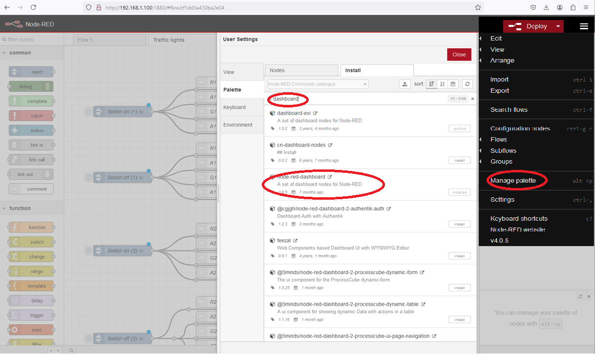

[Main Menu](../../sessions/README.md) |[session3](../../session3/) | [Intro to Node Red](../docs/Node-Red-Intro.md)

# Introduction to Node Red

Node-RED is a visual, low-code programming tool developed by IBM that connects hardware devices, APIs, and online services together. 
It's designed for the Internet of Things (IoT) but can be used for other applications as well.
Node-RED is easily installed on a Raspberry Pi and it provides a way to easily manipulate GPIO pins. 

   

## Installing Node RED
Follow the instructions to [Install Node Red on Raspberry Pi](https://nodered.org/docs/getting-started/raspberrypi)

This will show you how to run a script to install Node Red.

Accept the defaults for the configuration script.

Accept the installer option to install the standard GPIO library. 

(other gpio nodes are available if you want to experiment. 
See [interacting-with-pi-gpio](https://nodered.org/docs/faq/interacting-with-pi-gpio#node-red-node-pi-gpiod) )

Once installed, you can control Node-RED with the commands

```
node-red-start # to start

node-red-stop # to stop
```
or using the icon under `Menu / Programming / Node-RED`

Then point your browser to [http://localhost:1880](http://localhost:1880) or [http://{your_pi_ip-address}:1880](http://{your_pi_ip-address}:1880)

Once the node red application starts in your browser, you an use the `pallet` to install the following modules:

[node-red-contrib-ui-led](https://flows.nodered.org/node/node-red-contrib-ui-led)

[node-red-dashboard](https://flows.nodered.org/node/node-red-dashboard)

   

Now continue to the [Simple Traffic Light examples from Bob Potter](../docs/Simple-Pi-NodeRed.md) 

followed by [getting your Gertboard to work with the PI and the Wiring Pi library](../docs/gertboard-wiringpi-intro.md)

You can also learn more by playing with the tutorials listed below.

## Additional Tutorials on Node RED

To try turning on and off GPIO pins which you configured on the Gertboard, try the following tutorial

[GPIO Pins on Node Red on a Pi](https://projects.raspberrypi.org/en/projects/getting-started-with-node-red/0)
 
In this resource you will learn how to use Node-RED to communicate with the Raspberry Pi’s GPIO pins. You will create a Node-RED ‘flow’ to control LEDs.

See also the tutorial [getting started with node red on raspberry-pi](https://randomnerdtutorials.com/getting-started-node-red-raspberry-pi/)


