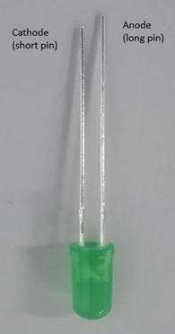
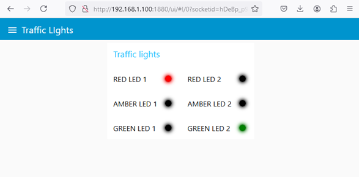
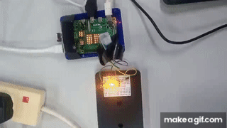

[Main Menu](../../sessions/README.md) |[session3](../../session3/) | [Simple Node Red Example PI](../docs/Simple-Pi-NodeRed.md)

# Simple Node Red Traffic Light Example PI

This example shows how to automate traffic light signals using Node RED.
(Thanks to Bob Potter for this example).

The objective of this exercise is to create a traffic light sequence using Node RED and then automate the switching on and off of traffic lights using the Raspberry PI GPIO.
The LED's must turn on and off in the following sequence:

```
1. RED
2. RED & AMBER
3. GREEN
4. AMBER
5. RED
```

## wiring

The circuit is constructed using a breadboard as illustrated in the following images.

   
   
   
   
   

## Flows

Install Node RED as described in [getting Node RED to work with your PI](../docs/Node-Red-Intro.md)

Start Node Red and browse to [http://localhost:1880/](http://localhost:1880/)

You can follow the tutorials and try creating your own flows.

You can also import Bob Potter's example flow from [trafficlightswindows_2_way_flow.json](../../session3/code/trafficlightswindows_2_way_flow.json)

This will import the following flow
   

You will be able to see the traffic lights changing on the dashboard at [http://localhost:1880/ui](http://localhost:1880/ui)
   

If you have wired up the LED's correctly, the automated traffic light LEDs are shown in this video: 

   
   
Alternatively, if you connect the Gertboard as discussed in the next section, you will be able to see 3 LEDs changing with the flow operation.


