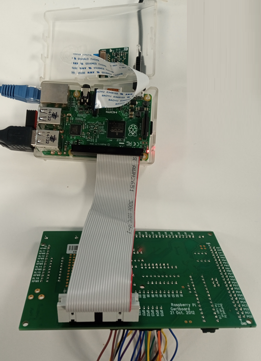

[session3](../../session3/) | [Intro to Gertboard and Wiring Pi](../docs/gertboard-wiringpi-intro.md)

# Intro to Gertboard and WiringPi

The Gertboard is a pre-assembled digital input output (IO) board designed for experiments with the Raspberry Pi. 
WiringPi is a software library which we can use to manipulate circuits implemented using the Gertboard.

## WiringPi

[WiringPi](https://github.com/WiringPi/WiringPi) is a library which can easily control the output pins of a Raspberry PI GPIO. 

To install wiring pi, you need do download the latest 32 bit package from the github [WiringPi releases](https://github.com/WiringPi/WiringPi/releases) site and install it on your local pi.

You can download the package into your Pi using `wget` which is a command line based browser.

```
wget https://github.com/WiringPi/WiringPi/releases/download/3.10/wiringpi_3.10_armhf.deb
sudo apt-get install ./wiringpi_3.10_armhf.deb 

```
WiringPi provides a command `gpio` which can control the pins from the command line.

```
gpio -h       # provides a simple list of commands
man gpio      # provides a full set of instructions
gpio readall  # lists the state of all of the pins
```

Once we have set up the Gertboard, we can use wiringpi to modify the inputs

## pin out details pi

The Broadcom chip on the PI contains a GPIO - General Purpose Input/Output module.

This is connected to the IO connector on the PI and a ribbon cable is used to connect this to the Gertboard.

The pin-out and pin numbering can be seen on [https://pinout.xyz/](https://pinout.xyz/)


## Gertboard

The Gertboard provides a lot of different IO options including analogue and digital inputs and outputs and drivers for high power relays.
However for this Module, we will only look at simple digital inputs and outputs.

A full toolkit of software and examples are provided by the designers of the board, which are linked below.
These are provided for reference and further investigation if you wish, but in this module, we will use a more simplified approach using WiringPi.


| local file              |reference link              | notes                   |
|:------------------------|:------------------------|:------------------------|
| GertBoard c software github |  https://github.com/ChrisCummins/gertboard_sw/tree/master   | Software supplied to use with Gertboard (Does not use WiringPi) |
| [assembled_gertboard_schematics.pdf](../docs/assembled_gertboard_schematics.pdf)  | [assembled_gertboard_schematics - reference](https://www.openhacks.com/uploadsproductos/assembled_gertboard_schematics.pdf) | detailed design schematics of Gertboard   |
|  [gertboardusermanual.pdf](../docs/gertboardusermanual.pdf)  |  [gertboardusermanual.pdf](https://www.farnell.com/datasheets/1683444.pdf)  | full user manual to use with software  |
|  [GertBoardOverview-1600404.pdf](../docs/GertBoardOverview-1600404.pdf)  | [Gertboard overview](https://www.farnell.com/datasheets/1600404.pdf)    | overview of Gertboard          |
|                        |  [raspberry pi pinout reference](https://pinout.xyz/)   |           |

### Simplified Gertboard setup

We will use the same Gertboard setup for all of our experiments which wires up three push buttons as inputs to the Pi and 9 Red LEDs as outputs.

To connect the Gertboard to the Pi use the ribbon connector as shown below.
NOTE. Turn the PI OFF before connecting the Gertboard and make sure you connect the ribbon the correct way round (note the red lead on the ribbon)

   


The circuit wired on the Gertboard is shown below. 

   
   
The LED's are driven by the buffer circuits which allow more power to light each LED than the Pi itself could provide. 

GPIO pins can be set for input or output.
(Other modes are possible but we wont cover them here)

If a pin is set for input, we can also set a `pull up` or `pull down` setting. 
Setting the pin to `pull up` allows us to connect a button which connects the pin to Ground (also known as earth or 0V) to give us a `0` input when the button is pressed.

For each of the three buttons, the GPIO chip must be configured to provide an internal `pull up` which makes the input `1` unless the button is pressed.


### Setting up wiring links for board

To set up the Gertboard to implement the circuit above, you need to apply the following links.

Jumper Power Link 3.3v (beside J4)

   
   
Jumper Links and Wire Links

   

|Jumper Links |
|:-------------------|
|OUT B1 ,B2, B3, B4 |
|OUT B5 ,B6, B7, B8 |
|OUT B9 ,B10, B11, B12 |

   
Wire links between GP pins and J2
   
| pi GPIO    | J2    |     |
|:---------- |:----- |:--- |
|GP25        |B1     |     |
|GP24        |B2     |     |
|GP23        |B3     |     |
|GP22        |B4     |     |
|GP21        |B5     |     |
|            |       | no Pi pin GP20    |
|GP18        |B6     |     |
|GP17        |B7     |     |
|            |       | no Pi pin GP16    |
|GP15        |B8     |     |
|GP14        |B9     |     |
|            |       | no Pi pin GP13    |
|            |       | no Pi pin GP12    |
|GP11        |B10    |     |
|GP10        |B11    |     |
|GP9         |B12    |     |
|GP8         |       |     |
|GP7         |       |     |
|            |       | no Pi pin GP6    |
|            |       | no Pi pin GP5    |
|GP4         |       |     |
|            |       | no Pi pin GP3    |
|            |       | no Pi pin GP2    |
|GP1         |       |     |
|GP0         |       |     |


# check input output

WiringPI has two numbering schemes for the GPIO pins. 

You can see the numbering scheme in use and the current state of the pins using the `gpio readall` command.

```
gpio readall
 +-----+-----+---------+------+---+---Pi 2---+---+------+---------+-----+-----+
 | BCM | wPi |   Name  | Mode | V | Physical | V | Mode | Name    | wPi | BCM |
 +-----+-----+---------+------+---+----++----+---+------+---------+-----+-----+
 |     |     |    3.3v |      |   |  1 || 2  |   |      | 5v      |     |     |
 |   2 |   8 |   SDA.1 |   IN | 1 |  3 || 4  |   |      | 5v      |     |     |
 |   3 |   9 |   SCL.1 |   IN | 1 |  5 || 6  |   |      | 0v      |     |     |
 |   4 |   7 | GPIO. 7 |   IN | 1 |  7 || 8  | 1 | ALT0 | TxD     | 15  | 14  |
 |     |     |      0v |      |   |  9 || 10 | 1 | ALT0 | RxD     | 16  | 15  |
 |  17 |   0 | GPIO. 0 |   IN | 0 | 11 || 12 | 0 | IN   | GPIO. 1 | 1   | 18  |
 |  27 |   2 | GPIO. 2 |   IN | 0 | 13 || 14 |   |      | 0v      |     |     |
 |  22 |   3 | GPIO. 3 |  OUT | 0 | 15 || 16 | 0 | IN   | GPIO. 4 | 4   | 23  |
 |     |     |    3.3v |      |   | 17 || 18 | 0 | IN   | GPIO. 5 | 5   | 24  |
 |  10 |  12 |    MOSI |   IN | 0 | 19 || 20 |   |      | 0v      |     |     |
 |   9 |  13 |    MISO |   IN | 0 | 21 || 22 | 0 | IN   | GPIO. 6 | 6   | 25  |
 |  11 |  14 |    SCLK |   IN | 0 | 23 || 24 | 1 | IN   | CE0     | 10  | 8   |
 |     |     |      0v |      |   | 25 || 26 | 1 | IN   | CE1     | 11  | 7   |
 |   0 |  30 |   SDA.0 |   IN | 1 | 27 || 28 | 1 | IN   | SCL.0   | 31  | 1   |
 |   5 |  21 | GPIO.21 |   IN | 1 | 29 || 30 |   |      | 0v      |     |     |
 |   6 |  22 | GPIO.22 |   IN | 1 | 31 || 32 | 0 | IN   | GPIO.26 | 26  | 12  |
 |  13 |  23 | GPIO.23 |   IN | 0 | 33 || 34 |   |      | 0v      |     |     |
 |  19 |  24 | GPIO.24 |   IN | 0 | 35 || 36 | 0 | IN   | GPIO.27 | 27  | 16  |
 |  26 |  25 | GPIO.25 |   IN | 0 | 37 || 38 | 0 | IN   | GPIO.28 | 28  | 20  |
 |     |     |      0v |      |   | 39 || 40 | 0 | OUT  | GPIO.29 | 29  | 21  |
 +-----+-----+---------+------+---+----++----+---+------+---------+-----+-----+
 | BCM | wPi |   Name  | Mode | V | Physical | V | Mode | Name    | wPi | BCM |
 +-----+-----+---------+------+---+---Pi 2---+---+------+---------+-----+-----+

```
BCM or 'Broadcom' is the pin output from the GPIO on the broadcom chip.
NOTE This number corresponds to the GP0 to GP25 pin numbers on the Gertboard. 

wPI is the alternative WiringPi number for the pin.
WiringPi attempts to standardise wiring using its own pin numbering scheme which we won't use.  

We will use the same pin BCM numbering as is used on the Gertboard by selecting the `-g` option.

You can blink the led on a pin using the following command

```
gpio -g blink 22 

(Control-c to exit)
```
This automatically puts the pin in output mode before blinking LED 5 1 to 0.

After using `blink` you can toggle the vlaue of a pin using

```
gpio -g toggle 22 

(Control-c to exit)
```

Normally, however, you need to explicitly set a pin to its output mode before setting output values.
You MUST put pins into input mode before setting output mode.

```
## to set the gpio pin to output - fires set to input mode
gpio -g mode 22 in
gpio -g mode 22 out
gpio -g write 22 1   # to set the output on
gpio -g write 22 0   # to set the output off
```

[testShellScript1.sh](../../session3/code/testShellScript1.sh) is a shell script which sets up a number of pins and scans up and down changing the led values.

To run use

```
cd code
sh ./testShellScript1.sh

(Control-c to exit)
```
If you want to play with more shell programming have a look at the [bourne shell tutorial](https://www.shellscript.sh/loops.html)

