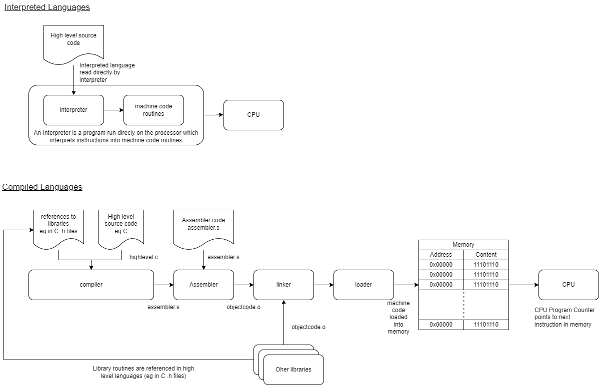

[Main Menu](../../sessions/README.md) | [session5](../session5/) 

# Session 5 Computer Languages

## Introduction

In this session we will look at computer programming languages and how they interact with the computer's hardware. 

The session will proceed in roughly the following order:

Introduction to Machine Code, Assembly code and High level Languages (This page).

[Introduction to ARM Assembler and C programming using CPUlator](../session5/docs/IntroToCPUlator.md)

[Subroutines and Stacks](../session5/docs/stacks-routines.md) 

[Interrupts](../session5/docs/Interrupts.md) 

[Assembler Examples](../session5/assemblerExamples/AssemblerExamples.md)

## Introduction to Machine Code, Assembly code and High level Languages.

In [Session2](../session2/) we saw how combinational logic can be used to create a microprocessor and we modified a small program for a [4 bit processor simulated in simulator.io](https://simulator.io/board/AWZpw7Fy3I/2)

We saw that the processor supported 12 instructions which could be arranged in the simulator's ROM as a very low level program.
```
Instructions:

0x00  IN        reads input to A
0x01  OUT       writes A to display
0x02  MOV xx    loads intermediate number to A
0x03  SWP       swaps register A and B
0x04  ADD       adds B to A, saves in A
0x05  SUB       subtracts B from A, saves in A
0x06  AND       AND on A and B, saves in A
0x07  OR        OR on A and B, saves in A
0x08  XOR       XOR on A and B, saves in A
0x09  NOT       NOT on A
0x0A  JMP xx    jumps to address
0x0B  JZ  xx    jumps to address, if zero flag is set
```

We also saw an example of binary CPU program to count up from 0.

|Address      | Value (binary) | Value (hex)  | op code    | description |
|:------------|:-------------- |:------------ |:-----------|:------------|
|0000 (0x00)  | 0010           | 0x02         | MOV 0x01   | loads 1 to A |
|0001 (0x01)  | 0001           | 0x01         |            | operand (value of MOV) |
|0010 (0x02)  | 0011           | 0x03         | SWP        | swaps register A and B |
|0011 (0x03)  | 0100           | 0x04         | ADD        | adds B to A, saves in A|
|0100 (0x04)  | 0001           | 0x01         | OUT        | writes A to display |
|0101 (0x05)  | 1010           | 0x0A         | JMP 0x03   | jumps to address 0x03 0011|
|0110 (0x06)  | 0011           | 0x03         |            | operand (value of JMP) |
|0011 (0x07)  | 0000           | 0x00         |            | No Operation |


Such binary CPU instructions are referred to as `Machine Code`.

You could enter the binary machine code directly but this would be time consuming and error prone. 
Instead programmers write low level programs in an equivalent human readable version of the program called `Assembly Code`.

An `Assembler` is a program which translates the human readable assembler source code, turning it into machine code to run on the processor.

`Assembly Code` is very specific to the processor which it targets.
It is designed to make it easy for a programmer to specify instructions for moving and manipulating data within processor registers and between the processor and external memory.

Assembler is not designed to make it easy to understand what the purpose of a program is, but it does allow for programmer comments, which are not part of the program, to help explain what the assembler code is doing.

## High Level Languages

A high level language such as C, Java, Python, BASIC or Java Script are designed to allow programmers to easily express high level concepts without being concerned about how this translates to the bits and bytes manipulated by the CPU.

A high level language is translated into low level machine code to run on a processor.

High level languages come in two fundamental flavours; `Interpreted Languages` and `Compiled Languages` as illustrated below.



`Interpreted Languages` read the input high level language and translate it `on the fly` into machine code routines which are immediately run on the processor. 

`Python`, `Javascript`, `PHP` and the `Bourne Shell` (`sh` or `bash`) are examples of `Interpreted Languages`.

Node RED is referred to as a `no or low code language` which is visually programmed. 
This is fundamentally also an interpreter but instead of interpreting a program, it is interpreting drawings of flows into routines in machine code.
Note that Node Red is itself written in Java Script so the processing order is 

`flow drawing -> javascript -> machine code routines`

Interpreted programs can be easier to write because they can be run and tested as you go along.
However, only the parts of the program which are actually run are tested so bugs may not show up until the program is actually used.
Further more the process of turning the human readable code into machine code needs to happen every time the program is run which can make the program much slower.

`Compiled Languages` are not run directly but go through an intermediate step called `Compilation` where the high level language is translated into `Assembler code` and then `Machine Code`.

The compilation process sometimes makes it slower to write and test programs than interpreted languages because of the intermediate compilation steps which occur before the program can be run.
However because the whole program is examined by the compiler before it is run, a compiled language can have additional checks and optimisations performed by the compiler which can ultimately make it much faster and less prone to programming errors.

Other components which work at a low level in preparing a machine code program to run are;

A `Linker` which links a program with any other programs or libraries it needs to run.

A `Loader` which loads the program and its libraries into memory ready to be run by the processor.

Link/Loaders are often core components within an operating system and are not necessarily explicitly visible to a user.

## Open and Closed Source Programs

Often compiled programs are shipped by their authors as pre-compiled machine code which is ready to run on the target system. 

Machine Code can be `disassembled` into assembler code but without any comments or the original high level language, this is very difficult for someone to understand.

Many companies rely on not distributing the original source code with the machine code as a way to protect their intellectual property.
This is called `Closed Source`.

On the other hand, many programmers now choose to distribute the source code freely with the compiled machine code.

This is called `Open Source`.
You will see many examples of this practice on Github and of course Linux and the `gcc` C compiler are very important examples.

## Practical Exercises

We will examine assembly and compiled languages further in the next section.

[Introduction to ARM Assembler and C programming using CPUlator](../session5/docs/IntroToCPUlator.md)


