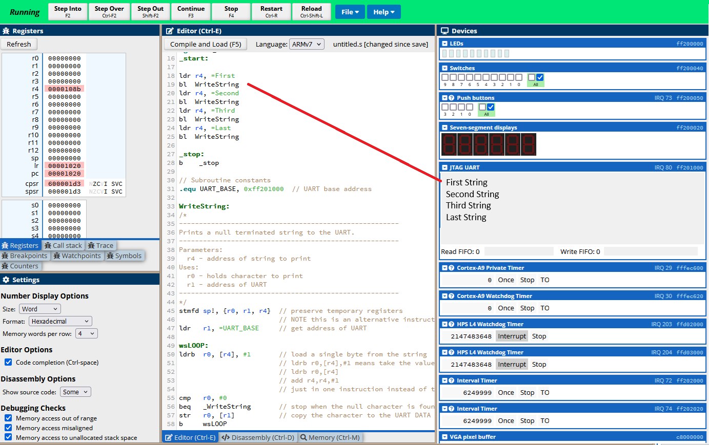

[Main Menu](../../README.md) | [session5](../../session5/) | [Assembler Examples](../assemblerExamples/AssemblerExamples.md)

# Assembler examples

Copy each of these examples into CPUlator editor with its Language set to `ARM-7`.

### Writing to a screen terminal UART

This example illustrates sending string to the UART (Universal Asynchronous Receiver/Transmitter) which is often used to send serial characters to a terminal.

An example Assembler program for writing to the UART Terminal is 
[write-jtag-uart.s](../assemblerExamples/code/write-jtag-uart.s)

Load the example ARM7 assembly code into CPUlator and press `Compile and Load`.

Press `Continue` and see the strings written to the UART display.

(The original source for this example came from David Brown https://bohr.wlu.ca/cp216/labs/lab08InputOutput.php#Topicss)

## Sending pictures to the VGA

VGA Example - illustrates displaying multiple images to the VGA.

See [vga-example.s](../assemblerExamples/code/vga-example.s)

This example illustrates writing pictures to the VGA adaptor. 
Not that the 3 pictures are encoded as Hex words at the bottom of the assembler code.

( The original source for this example is [https://github.com/Tapendra-195/Armv7/tree/main](https://github.com/Tapendra-195/Armv7/tree/main)
 which also has a python program to read additional pictures into an array)

## Further ARM Assembler Tutorials

If you want to explore ARM Assembler further here are a set of tutorials. 
(Googling will find you many more).

[An ARM assembler cheat sheet can be found here](https://azeria-labs.com/assembly-basics-cheatsheet/)

[David Brown ARM Tutorials with CPUlator](https://bohr.wlu.ca/cp216/labs/)

[Kevin bone ARM assembly-language programming for the Raspberry Pi](https://kevinboone.me/pi-asm-toc.html)

A full book on programming in assembler using the Raspberry PI is available here

[Introduction to Computer Organization: ARM Assembly Language Using the Raspberry Pi Robert G. Plantz](
https://bob.cs.sonoma.edu/IntroCompOrg-RPi/sec-gpio-mem.html)  Very comprehensive

[ARM Assembler by Example by Kyle Baldwin](https://armasm.com/)

