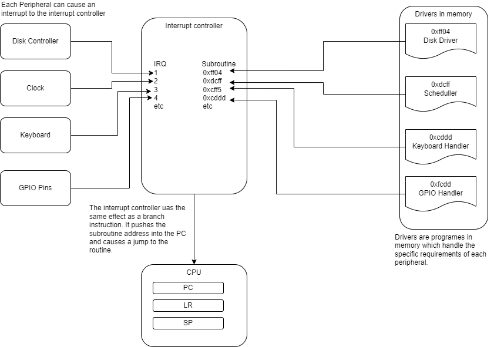

[Main Menu](../../README.md) | [session5](../../session5/) | [Interrupts](../docs/interrupts)

# Interrupts

We have previously looked at various ways to scan inputs from the GPIO, but it may occur to you that this is quite inefficient because it ties up our processor continuously just looking at the pins.
It is also quite slow, because if something happens to one of the pins, it will not be detected until our program comes around to poling its state.

Interrupts are a mechanism by which a peripheral can send a signal which `interrupts` whatever the CPU is doing, causing it to jump to a subroutine before returning to its previous tasks.

We are not going to look in detail at interrupt programming, but here is a brief introduction.

The figure below illustrates how peripherals use an `interrupt controller` to cause the CPU to jump to a subroutine designed to handle the peripheral.
The IRQ instruction is very similar to the branch programming instructions except that a hardware signal is causing the branch to occur.
The `interrupt controller` is programmed with a mapping between each interrupt and the address of the subroutine which can handle the interrupt.

The `driver` code which responds to the interrupt is responsible for responding quickly and returning the CPU to its previous state so that normal operation can continue.



If you look again at the devices list for the GPULator, you will see that the input devices all have an `IRQ` number.

```
Address range       Size    IRQ Name 
ff200050–ff20005f   16      73  Push buttons    
ff200060–ff20006f   16      11  Parallel port   
ff200070–ff20007f   16      12  Parallel port   
ff200100–ff200107   8       79  PS/2 keyboard or mouse  
ff200108–ff20010f   8       89  PS/2 keyboard or mouse    
fffec100–fffec113   20          ARM Generic Interrupt Controller    
fffec600–fffec60f   16      29  Cortex-A9 Private Timer 
fffec620–fffec637   24      30  Cortex-A9 Watchdog Timer    
```

It is possible to write programs which set up the [ARM Generic Interrupt Controller](https://developer.arm.com/documentation/198123/0302/What-is-a-Generic-Interrupt-Controller-) to respond to these simulated peripherals.
However programming the [ARM Generic Interrupt Controller](https://developer.arm.com/documentation/198123/0302/What-is-a-Generic-Interrupt-Controller-) is a complex task beyond the scope of this module.

The WiringPI library can make it much simpler to respond to GPIO interrupts on the Raspberry PI using C.
If you are interested you can look at the [Raspberry PI GPIO interrupts tutorial](https://roboticsbackend.com/raspberry-pi-gpio-interrupts-tutorial/) (Not for the faint hearted).

## Interrupts - Key Take Aways

All modern computer systems are `event driven` with processes responding to internal and external events. 
Events are usually mediated through hardware and software `interrupts`.

We have seen that the `interrupt controller` is used to program how the processor responds to interrupts from peripherals. 
We have also seen that fundamentally, `software drivers` or `device drivers` for peripheral devices are `sub routines` which handle the interrupts from the device.

A modern operating system will do most of the 'heavy lifting' when it comes to handling interrupts but it will also use interrupts from the internal `clock` to schedule multi-processing which simulates multiple processes running in parallel on the system.
We will look more at scheduling when we cover operating systems later in the module.

Go back to [Introduction to CPUlator](../docs/IntroToCPUlator.md) and look at the assembler examples at the end of the page.
