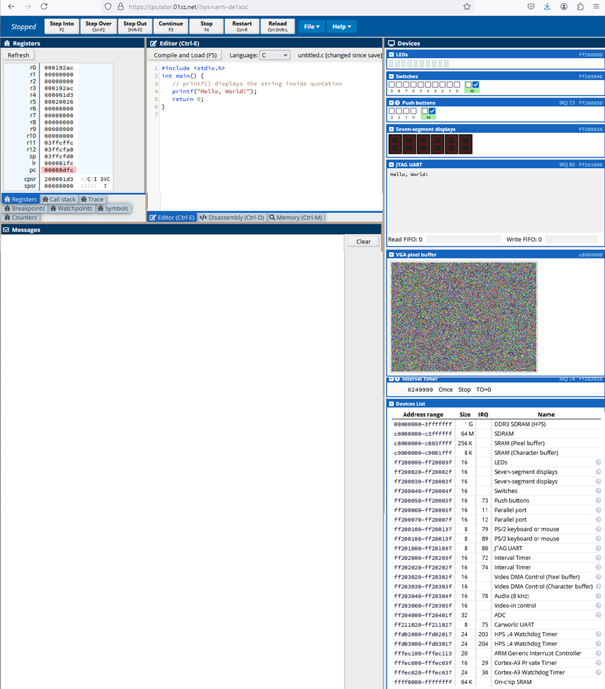

[Main Menu](../../README.md) | [session5](../../session5/) | [Introduction to CPUlator](../docs/IntroToCPUlator.md)

# Introduction to ARM Assembler and C programming using CPUlator

In this section we will introduce programming an ARM processor using a simulator before looking at applying this to the Raspberry PI in the next session.

[CPUlator](https://cpulator.01xz.net/) is a free CPU simulator written in 2016 for teaching use by [Henry Wong](https://www.stuffedcow.net/teaching) when he was doing his PhD at the University of Toronto. 

CPUlator is a simulator and debugger of a computer system (CPU, memory, and I/O devices) that runs inside a web browser. 
Simulation allows running and debugging programs without needing to use a hardware board.

CPUlator can be used to simulate an ARM 7 processor which is similar to the processor used in the Raspberry Pi.
Although running much slower than a real CPU, the simulation is completely accurate and allows small programs to be written and run as if they were running on real hardware.

Open a browser and browse to [https://cpulator.01xz.net/?sys=arm-de1soc](https://cpulator.01xz.net/?sys=arm-de1soc)

You will see a screen similar to the image below (but without the C program).



## ARM Registers

The full [ARM 7 documentation](https://developer.arm.com/documentation/ddi0406/latest/) is very complex, but we shall simplify it here.

On the left panel of GPUlator, you will see the ARMv7 registers. 

The ARM architecture provides sixteen 32-bit general purpose registers (R0-R15) for software use. 

R0-R14 can be used for any purpose.

R13 (SP), R14 (LR) and R15 (PC) have special purposes as described below.

In addition, the results of previous operations are stored as individual bits in the CSPR and SPSR registers.

| name               | function                        |
|:-------------------|:--------------------------------|
|R13 (SP)            | Stack Pointer<BR>SP always points to the next available free space on the memory stack. |
|R14 (LR)            | Link Register<BR>LR is link register used to hold the return address for a function call.                   |
|R15 (PC)            | Program Counter<BR> The PC value is altered as the core executes instructions. An explicit write to R15 by software will alter the program flow. |
|CPSR                | Current Program Status Register.<BR> (The following flags of the CPSR are the most important).<BR>N, bit [31] Negative condition flag. Set to 1 if the result of the last flag-setting instruction was negative.<BR>Z, bit [30] Zero condition flag. Set to 1 if the result of the last flag-setting instruction was zero, and to 0 otherwise. A result of zero often indicates an equal result from a comparison.<BR>C, bit [29] Carry condition flag. Set to 1 if the last flag-setting instruction resulted in a carry condition, for example an unsigned overflow on an addition.<BR>V, bit [28] Overflow condition flag. Set to 1 if the last flag-setting instruction resulted in an overflow condition, for example a signed overflow on an addition. |
|SPSR                | Saved Program Status Register. SPSR contains a saved copy of the CPSR from the previously executed mode. |
|                    |                                 |

## Memory Mapped peripherals

On the right hand panel you will see a representation of each of the peripherals. 

As in most computers, the control registers provided by each peripheral are mapped onto memory addresses which can be accessed by the CPU.

In this simulator, each peripheral has a different address range and the peripheral is controlled by saving bytes into the registers within the address range of the device.

At the bottom of the CPUlator peripheral panel, you will see a range of addresses along side the name of the device and a link `(?)` to the devices documentation.
Each device has a different set of registers with different functions which are described in the referenced documentation.

```
Address range       Size    IRQ Name
00000000–3fffffff   1   G       DDR3 SDRAM (HPS)    
c0000000–c3ffffff   64  M       SDRAM   
c8000000–c803ffff   256 K       SRAM (Pixel buffer) 
c9000000–c9001fff   8   K       SRAM (Character buffer) 
ff200000–ff20000f   16          LEDs    
ff200020–ff20002f   16          Seven-segment displays  
ff200030–ff20003f   16          Seven-segment displays  
ff200040–ff20004f   16          Switches    
ff200050–ff20005f   16      73  Push buttons    
ff200060–ff20006f   16      11  Parallel port   
ff200070–ff20007f   16      12  Parallel port   
ff200100–ff200107   8       79  PS/2 keyboard or mouse  
ff200108–ff20010f   8       89  PS/2 keyboard or mouse  
ff201000–ff201007   8       80  JTAG UART   
ff202000–ff20200f   16      72  Interval Timer  
ff202020–ff20202f   16      74  Interval Timer  
ff203020–ff20302f   16          Video DMA Control (Pixel buffer)    
ff203030–ff20303f   16          Video DMA Control (Character buffer)    
ff203040–ff20304f   16      78  Audio (8 kHz)   
ff203060–ff20306f   16          Video-in control    
ff204000–ff20401f   32          ADC 
ff211020–ff211027   8       75  Carworld UART   
ffd02000–ffd02017   24      203 HPS L4 Watchdog Timer   
ffd03000–ffd03017   24      204 HPS L4 Watchdog Timer   
fffec100–fffec113   20          ARM Generic Interrupt Controller    
fffec600–fffec60f   16      29  Cortex-A9 Private Timer 
fffec620–fffec637   24      30  Cortex-A9 Watchdog Timer    
ffff0000–ffffffff   64  K       On-chip SRAM    
```

We are only going to play with the JTAG UART, the VGA display, and the Seven-Segment numbers.

## Exercise: Running our first C program on the CPUlator

### A simple C program 

Note - if you want to learn more about C see the [W3 Schools C Tutorial](https://www.w3schools.com/c/index.php).
Many of these W3 Schools examples will also work in CPUlator or on your Pi.

Open the [CPUlator ARM 7 simulator](https://cpulator.01xz.net/?sys=arm-de1soc), set the Language to `C` and paste the following C program in the Editor window.

```
#include <stdio.h>
int main() {
   // printf() displays the string inside quotation
   printf("Hello, World!");
   return 0;
}
```
This very simple program prints "Hello, World!" to a simple text terminal.

(The program is actually writing characters to a simulated device called a UART (universal asynchronous receiver / transmitter) which uses a simple, two-wire protocol for exchanging serial data such as characters to and from a terminal).

The `#include <stdio.h>` directive describes the libraries which may be called by the program. 
In this case we are using the [Standard IO library for C](https://www.w3schools.com/c/c_ref_stdio.php)

`main()` is always the entry point for a program.

`printf()` is the function imported from `stdio.h` which we are using to print our output to the UART.

The program should `return 0` to the calling process if it completes correctly.
(Other numbers may indicate an error condition).

### Compiling and running the C program

Set the language button to `C` and press `Compile and Load`

After a few seconds, you will see `Compile Succeeded` in the Messages window.

You will also see a `Disassembly` of the compiled C code in the Disassembly widow. 
This represents the compiled object code as it is actually located in the simulator's memory by the `link/loader`.

You will note that this simple program has created a lot of Assembler code.
Most of this is library code added by the linker to allow the `printf` command to run.

At the top of the CPUlator, you will see commands to run the program.

`Step Into` - runs a single machine code instruction and pauses. 
This allows you to look at the changes in registers and memory at each step.

`Continue` - runs the entire program until its completion or until a `breakpoint` is encountered.

You can set `breakpoints` in the assembly code by clicking on the panel beside the Address of the instruction where you want to pause.
Try using breakpoints to pause your program and see what is in the registers and memory at that point.

Click `Continue` and look at the output in the JTAG Uart window - which is actually simulating a terminal.

You should see "Hello, World!"

The GPULator disassembly window shows us all of the corresponding machine code which has been put in memory by the linker and which also includes all of the assembly code to implement the `printf` function.

We can see the specific translation of our program if we search in the disassembly window  for the `main:` lable.
This corresponds to the `main()` function call in the C code.


I have added comments to the disassembled code below so help you understand the assembly program.

```
main:
push {r4, lr}               // At the start of the function call push r4 and lr Link Register onto the stack
                            // This preserves the r4 data and the LR location for when we return from our program.
movw r0, #30316 ; 0x766c    // Fill the bottom 16 bits of 32 bit register r0 with 0x766c
movt r0, #1 ; x0x1          // Fill the top 16 bits of 32 bit register r0 with 0x1 (so r0 points to address 0x1766c )
bl 0x8ab0 (0x8ab0: printf)  // Call printf function by branching to its address
mov r0 #0 ; 0x0             // Clear r0 to 0 (this is the return value 0 )
pop {r4,pc}                 // Restore r4 and jump to next instruction which was in link register
```

If we look at memory location 0x1766c we can see it contains the string "Hello, world".
So the program is passing the address of the "Hello, world" string as an argument to the `printf` function.


### Stacks, Subroutines, Interrupts

To complete our introduction to programming concepts, look at [Subroutines and Stacks](../docs/stacks-routines.md) 

Then look at [Interrupts](../docs/Interrupts.md) 

Now try the assembler examples below.

## The same example written directly in assembler

We can see that the compiler has compiled our program into assembler.

The high level C code is very easy to understand while the assembled code is much more difficult to follow.
However, raw assembler is often still used because of its speed and small memory footprint (particularly important for small devices).
You also obviously need to understand assembler if you are writing compilers or interpreters.

To give you more experience with Assembler, I have provided some complete assembler examples including one which writes to the UART directly without using the printf function.

Try the exercises in [Assembler Examples](../../session5/assemblerExamples/AssemblerExamples.md) before moving on.


