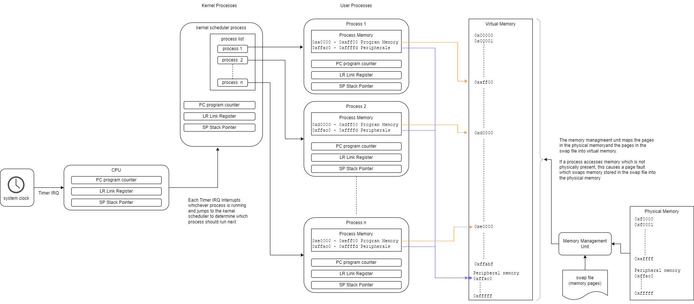

[Main Menu](../../README.md) | [session6](../../session6/) | [Operating Systems](../docs/operating-systems.md)

# Introduction to Operating Systems

## Introduction

In this session we will introduce the core concepts underlying modern `Operating Systems`.

You will be familiar with `Microsoft Windows` and we have been introducing you to `Linux`, both of which are examples of very widely used `Operating Systems`.

An `operating system (OS)` is system software that manages computer hardware and software resources, and provides common services for computer programs ([Source Wikipedia](https://en.wikipedia.org/wiki/Operating_system)). 
In short, an `operating system` provides a set of libraries and utilities which standardise and take a lot of the 'grunt work' out of writing programs to run on a computer.

In previous sessions, we have gradually built up our understanding of how computer hardware works and how it can be programmed with low and high level languages.

We have also looked at how `software libraries` can provide pre-written `sub routines` or `procedures` which can simplify our program's use of the underlying hardware.

Finally, we have introduced `Interrupts` as a mechanism for peripherals to interrupt a running program to call `device driver subroutines` which can handle events such as keyboard key presses.

The diagram below illustrates how an operating system uses interrupts to perform `multi-tasking (scheduling)` and `memory management`.

## Scheduling

Modern computers appear to be doing many tasks at the same time. 
The reality, however is that the `operating system` is managing the CPU so that it's time is shared across multiple processes giving the illusion of `multi tasking`

Processes are represented by areas of memory which hold the code, variables and copies of the CPU's PC, LR and SP from when the process was last running.

The scheduler is itself a process which holds a table of all the processes in the system and responds to system clock and other interrupts.

When a system clock interrupt occurs, the currently running process is stopped and its current PC, LR and SP are stored in the process table.

The scheduler then decides which process should run next and copies the PC, LR and SP for that process into the CPU so that the process proceeds from where it last left off.

Normally processes are run on a `round robin` basis, giving each process equal time to run on the CPU.
However, the scheduler also responds to `software interrupts` from processes when they make a request from the operating system which will require them to wait (for instance an inhernetly slow request to write to a file on disk).
Processes can also be ranked in priority so that high priority processes are run before low priority tasks.

The flow of program execution for each process is called a  `thread` and a system may have many thousands of `theads` either running or ready to run.

A thread is running when the process is scheduled on the CPU.

Many computers now have multiple CPU cores.
For instance, the Raspberry PI has 4 ARM cores.

This allows the scheduler to schedule up to 4 threads to run in parallel, one on each CPU.

## Memory Management

Early computers had very little  RAM (random access memory) because it was very expensive. 
But useful programs needed a lot of RAM to be able to run - which posed a big problem for commercially viable computing.

`Virtual Memory` was invented as a mechanism which allowed the computer to operate as if it had infinite amounts of RAM without needing to provide large amounts of real RAM.

Although RAM was expensive, Disk Drives provided much slower memory which was much less expensive to use.

The idea of `Virtual Memory` was to define a very large address range which processes could access and divide this address range into `Memory Pages` of hundreds of kilobytes.

At any point of time, only some of these `Pages` would be loaded into the physical RAM.
The rest of the pages would be stored in a `Swap File` on disk.
If the CPU requested access to a memory address which was not presently in RAM, a `Page Fault` would occur which caused a currently inactive page to be written out to the swap file, and the page containing the requested address to be read into the physical RAM.

Today virtual and real memory are managed by `memory management processes` and a hardware `Memory Management Units` which together track which pages are in memory or on disk and perform `page swaps` when a `page fault` occurs.
A `page Fault` is essentially just another form of interrupt which calls procedures in the operating system to swap physical RAM with the file system.

Although RAM is now much less of a limiting factor, memory management using swapping is still an important task performed by an operating system. 
A lot of the time, processes can be idle and swapping their memory out of RAM can greatly increase the capacity of a machine. 
For instance, if your machine is serving a large number of lightly used web sites, the processes serving the web sites which are currently dormant can be swapped out of memory.

Even with large memory, having a `swap file` prevents the computer crashing if it ever runs out of physical memory.
However, in general it is important to reduce the amount of swapping to a minimum since it significantly slows down a system.

Also, on a Raspberry Pi, the disk is implemented using an SD card.
An SD card's life is severely limited if it is written to very frequently. 
This means that frequently using the swap file on an SD card is very much to be avoided on a Raspberry Pi.

For more info on how virtual memory works in practice on an ARM CPU, see [ARM Virtual and physical addresses](https://developer.arm.com/documentation/101811/0104/Virtual-and-physical-addresses)

## Kernel and User Processes

Scheduling, Memory Management and handling peripherals through drivers are processes which are shared across many users of the system.
These processes are called `kernel processes` because they are at the heart of the system and run with special privileges allowing access to all of the memory in the system.

`User processes` run outside of the kernel and the amount of time and which parts of the system they can access are closely controlled privileges granted by the kernel. 

Note that the peripherals are also mapped into the virtual memory address space for processes but can only be accessed if the process has the privilege to access that peripheral.

Having reviewed Operating Systems, now look at the exercises in  [session6](../../session6/) .
