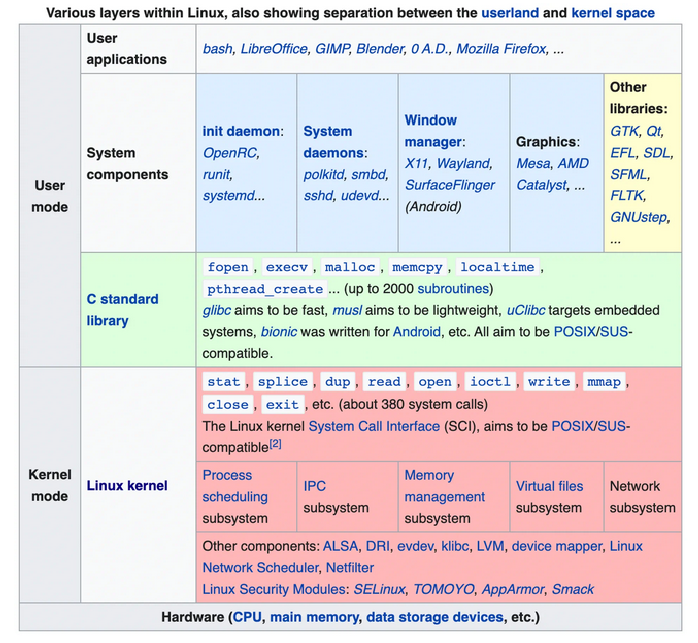
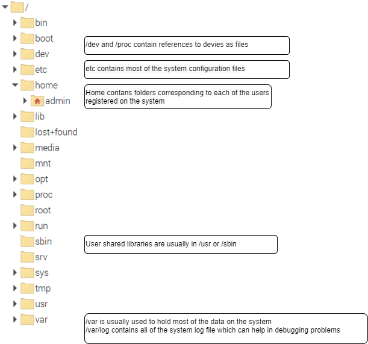

[Main Menu](../../README.md) | [session7](../../session7/) | [Operating System Structure](../docs/operating-systems-structure.md)

# The origins of the Linux Operating System

In the 1970's AT&T developed the original C programming language and used this to write a new operating system called `Unix`.
Gradually Unix and C became increasingly popular and computer manufacturers began developing their own variants to run on their own workstations; 

* HPUX - Hewlett Packard
* Solaris - Sun Microsystems
* AIX - IBM
* Ultrix - Digital Equipment Corporation

The CPU's underlying these systems were also significantly different with IBM hardware using PA-RISC processors and Sun using SPARC (Scalable Processor ARChitecture).

In theory, a program written in C to run on a Unix OS could run on any of these variants but there were sufficient differences that this was not the case. This lead to the development of the [POSIX Compliant Unix standard](https://en.wikipedia.org/wiki/POSIX) which standardised the system calls across unix systems.

In parallel with this, [Richard Stallman](https://en.wikipedia.org/wiki/Richard_Stallman) who was a researcher at MIT, became increasingly annoyed with the way companies were hiding the details of their operating systems by keeping their programs 'closed source'. 
Stallman resigned from MIT in 1983 and started developing a Unix like operating system which would be free for anyone to use and would be published as open source program. 
He developed the `gcc` compiler and a variety of software utilities released as part of the [GNU project](https://www.gnu.org/home.en.html)

A key innovation was to publish the software under the [Copy Left GPL licence](https://en.wikipedia.org/wiki/GNU_General_Public_License) which forced people who copied or extended the source code to publish their work under the same licence.

At the 1990's, [Linus Torvalds](https://en.wikipedia.org/wiki/Linus_Torvalds) began a Masters project at the University of Helsinki trying to develop a Unix kernel which would work on low cost Intel Processors.
He discovered the GNU project in 1991 and realised that the kernel he was developing could be combined with the GNU utilities to create a fully open source operating system.

The first Linux prototypes were publicly released in late 1991 and Version 1.0 was released on 14 March 1994.

Linux gradually became increasingly popular with researchers and hobbyists and it increasingly appeared to become a viable `POSIX-compliant` alternative to paid-for operating systems
An eco system of linux contributors emerged and companies and not-for-profit groups began to form which created and supported `distributions` of Linux.
Linux has since grown to be the major operating system powering the cloud and the Internet.

Today there are [many Linux distributions](https://en.wikipedia.org/wiki/List_of_Linux_distributions) which can primarily be categorised based upon the packaging mechanism they use.

The [Debian project](https://www.debian.org/doc/manuals/project-history/intro.en.html), which uses `.pkg` packages is the basis of [Ubuntu](https://ubuntu.com/) and [Raspberry OS](https://www.raspberrypi.com/software/)

Canonical, which distributes Ubuntu, has an estimated market cap between $40–59 million

The [Fedora project](https://fedoraproject.org/) which uses `.rpm` packages is the basis of [Red Hat Enterprise Linux](https://www.redhat.com/en/technologies/linux-platforms/enterprise-linux) and its various variants, [Centos](https://www.centos.org/), [Rocky linux](https://rockylinux.org/) etc.

Red Hat was acquired by [IBM in 2019 for $34 billion](https://www.redhat.com/en/about/press-releases/ibm-closes-landmark-acquisition-red-hat-34-billion-defines-open-hybrid-cloud-future)

In addition Android is also based upon a modified Linux core.

# Operating System Structure

Most Operating systems consist of a `Kernel`, a set of shared services which run in `kernel space` and a set of `utilities` which operate in `user space`.

The figure below highlights some of the key components in the Linux operating system.



[Source Wikipedia](https://en.wikipedia.org/wiki/User_space_and_kernel_space)

A key aspect of Linux is that there are many choices which can be made as to which libraries are used to provide services in any particular layer.
In principle, this makes a Linux based system much more flexible and adaptable than a windows system.

## Kernel

The Kernel is the minimal viable set of processes which provide the core operating system services.
This includes the scheduler, device drivers, virtual memory management and file systems.

Kernels are version controlled and all libraries and programs in a certain system can only be run against a specified range of kernel versions.

## File Systems and Security

The Linux file system is organised hierarchically with (more or less) standard locations for different types of files.


Note that devices and processors are also modelled as part of the file system.

### File permissions

File permissions are core to the security model used by Linux systems.
They determine who can execute files or read or write to files and directories on a system.

All files have an owner which is a user registered in the system.
When you create a file, it will be given you as the owner.
 
The owner can be `root` if it is a system file.

All owners are also in a group

When you list a directory, you can see the contained files ownership and permissions.

```
admin@raspberrypi01:~/devel $ ls -all
total 84
drwxr-xr-x  6 admin admin  4096 Oct 22 12:14 .
drwx------ 22 admin admin  4096 Oct 22 18:23 ..
drwxr-xr-x  7 admin admin  4096 Oct 15 09:40 COM304_FOUNDATION_1
-rw-r--r--  1 admin admin   883 Oct 21 12:34 test-input-script.sh
```
The first column lists the permissions for each file.
These are organised as a directory bit `d` and three sets of three bits labelled `r`read, `w` write, `x` execute

Each of the three `rwx` bits applies to owners, groups or all users.

```
directory   Owner Group All
d           rwx   rwx   rwx
```

`Owners:` These permissions apply exclusively to the individuals who own the files or directories.

`Groups:` Permissions can be assigned to a specific group of users, impacting only those within that particular group.

`All Users:` These permissions apply universally to all users on the system.

## User Interface

Early UNIX systems had simple ASCII terminal based user interfaces offering a Command Line interface (CLI) which can be accessed using SSH.

The [X window system](https://en.wikipedia.org/wiki/X_Window_System) was released by MIT in 1987 and has been the go-to windows graphical interface for UNIX and Linux for many years.

More recently, the [Wayland](https://wayland.freedesktop.org/) replacement for the X11 window system protocol has been making progress.

Both X and Wayland are options for later Raspberry Pi's

## Language Systems
Multiple language systems can be present in a Linux system. 

Often by default, only the `runtime` libraries for a given language are installed.
These libraries are necessary to run a program written in the language but not to create a new program.

If you want to create and compile new programs, then the languages development libraries must also be installed and possibly also the Kernel development libraries so that the language can make calls against the kernel.

## Boot System Structure

An operating system is a complex program which needs a lot of processes and data structures to be set up before it is ready to run. 
The process of starting up an operating system is called the `boot process`.

PC motherboards have a BIOS (Basic Input Output System) which is a firmware program (i.e. on ROM) that will provide basic diagnostic and configuration functions without loading an operating system.
The BIOS is responsible for looking at each of the disks in a pre-defiend order to find a small program called a `boot loader`.
The BIOS also tells the operating system what hardware is installed on the board.

Larger servers have a more sophisticated controller called an Intelligent Platform Management Interface, IPMI](https://en.wikipedia.org/wiki/Intelligent_Platform_Management_Interface) which is like a BIOS on steroids.
An IPMI supports data-center automation and power management.
Data Centre servers also support [PXE Boot interfaces](https://en.wikipedia.org/wiki/Preboot_Execution_Environment) which allows the server to boot an operating system supplied over the network rather than on a local disk.

The `boot loader` loads the key kernel components from the operating system disk and then passes control to the loaded kernel which finishes starting up all of the required systems.

The reason this is called a boot process is because it is like the computer is in the process of pulling itself up using its own boot straps
 
A common boot loader used in most Linux distributions is called [GRUB](https://www.gnu.org/software/grub/).
But this is not used on the Raspberry Pi.

Note that the Raspberry PI is a very small device and does not have a BIOS. 
It has an unusual bespoke boot process which involves first loading the boot program from the SD Card into the Graphics Processing Uni. 
If you are interested see [Raspberry PI Boot Process](https://stackoverflow.com/questions/16317623/how-does-raspberry-pis-boot-loader-work)

## Key Shell Commands

Users can interact with Linux using a terminal session which runs the `bourne shell`
It is worth taking time to become familiar with some of the key terminal commands:

| command | purpose                                                  |
|:--------|----------------------------------------------------------|
|  pwd    | present working directory - shows the location of the current directory|
|  ls     | Lists all files in a directory<BR>ls -all shows permissions  |
|  mkdir  | creates a directory |
| rm      | removes a file<br>rm -R removes a directory and its contents |
|  vi     | basic text editor which is on most linux systems   |
|  nano   | easier to use text editor                                 |
|  df -h  | Shows how much disk has been used |
|  top    | shows top processes and memory allocation on the system |
|  ps     | shows processes belonging to you<BR> ps -aux shows all processes on the system<br>ps -aux | grep 'process name' finds a particular process |
| sudo    | performs a command with root privileges if you are in the sudoers group  |
| ping    | checks connectivity to a url or IP address |
| ifconfig| shows all ethernet interfaces adn IP addresses |
| route -n | shows the routing table |

Here is a useful [command line for beginners tutorial](https://ubuntu.com/tutorials/command-line-for-beginners#1-overview)

## Package Management

Package manamgent is a key function on operating systems. 
THe following exercise explains package managment and takes you through installing the Apache 2 web server on your Raspberry PI.

Exercise  [Installing Apache Web Server](../docs/package-management-apache.md)


