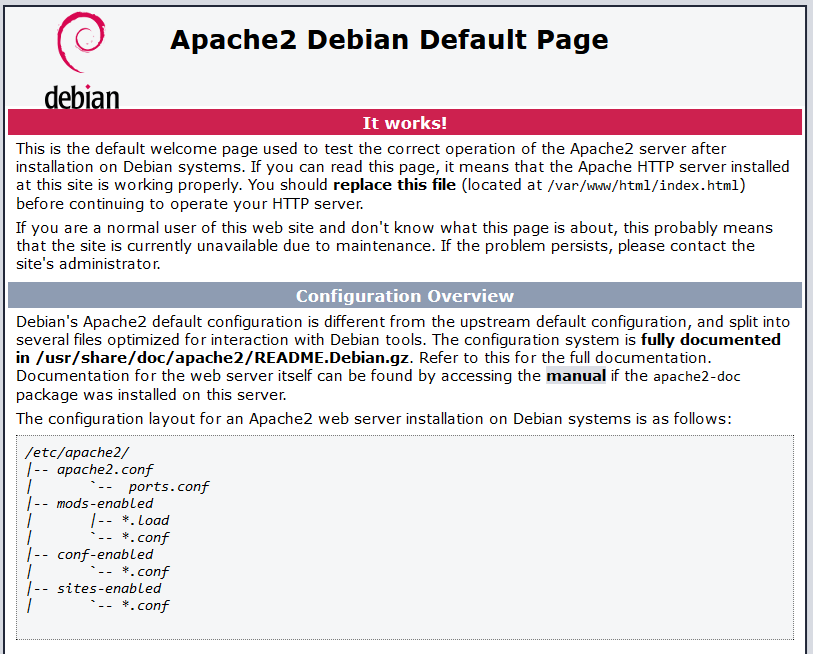
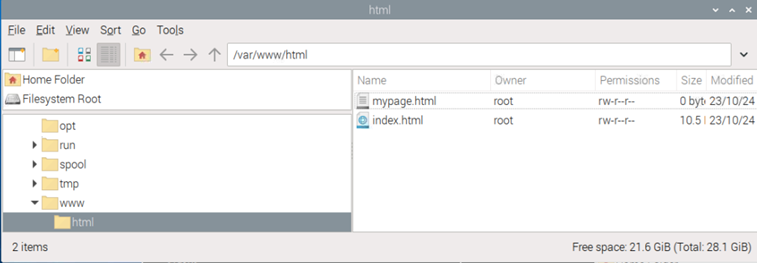
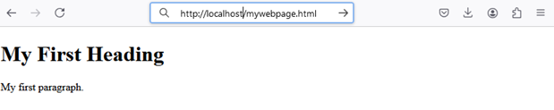

[Main Menu](../../README.md) | [session7](../../session7/) | [package management](../docs/package-management-apache.md)

# Operating System Package Management

In this section, we will first give an overview of package management before looking specifically at how to install an apache 2 web server on debian system or a Raspberry Pi.

## Overview of System Package Management

A full operating system consists of multiple software component which, depending on the application, may or may not need to be installed.
Each of these components may in turn rely on other packages or utilities in order to operate.

Software programs are usually shipped pre-compiled and packaged with metadata which describes where and how the program is to be installed.

For instance, in Microsoft Windows, programs are usually packaged as `Dynamic Linked Library (DLL)` with the file name suffix `.dll` files.
A DLL is a library that contains code and data that can be used by more than one program at the same time. 
Windows itself consists of many `.dll` files in the `C:\Windows\System32` folder.

If you look at each of the programs installed in `C:\Program Files`, you will see that they each have multiple .dll files which have been installed buy the Microsoft Software Installer from `.msi` files ( a file format used to install, maintain, and remove software on Windows systems).

Linux distributions use a similar mechanism to manage pre-compiled programs.

We have seen that in Linux, a compiled program (object code) is shipped in `object files` with the suffix  `.o` or `shared object files` with the suffix `.so`
These files need to be placed in the correct directory so that they can be found by the operating system when the program is run.
When a program is installed, we will also want to install other files such as configuration files or documentation.

There are two package formats commonly used in linux

Red Hat derived operating systems (RHEL, CENTOS, RockyLinux, Suse) packages programs as RPM files (Red Hat Package Manager) which are managed using a program called `yum` (lately updated to `dnf`).

Debian derived operating systems (Debian, Centos, Raspbery OS) use DEB files `.deb.` with package managers called `apt` or `apt-get`c
Package managers mostly do similar things, but we will concentrate on Raspberry OS package management in this session.

## Using apt to install packages on debian systems

APT maintains a database of the latest software which can be installed in a particular version of a debian derived linux.

Before installing any new software, you need to ensure the local apt database is up to date:

```
sudo apt update
```

If you just want to update all existing packages to the latest versions, use

`sudo apt upgrade`

If you want to install a particular package use

```
sudo apt install <package name>
```

To see what other packages a package depends upon try

```
sudo apt depends <package name>
```
As you move on with Linux, a good working knowledge of package management will really help you.

There are lots of online tutorials on apt and `man apt` will also help you.

## Installing Apache2 on your Raspberry Pi

The [Apache HTTP Server](https://httpd.apache.org/) has long been the number one web server on the Internet.
We are going to install it on the Pi.

If you are connected to the internet, you can use

`sudo apt install apache2`

Alterntively, if your internet connection is slow or not working you can install directly from files which have been downloaded in advance.

Download (or transfer using a USB memory stick) the following files to your Pi:

```
apache2_2.4.62-1~deb12u2_armhf.deb        
libapr1_1.7.2-3_armhf.deb
apache2-bin_2.4.62-1~deb12u2_armhf.deb    
libaprutil1_1.6.3-1_armhf.deb
apache2-data_2.4.62-1~deb12u2_all.deb     
libaprutil1-dbd-sqlite3_1.6.3-1_armhf.deb
apache2-utils_2.4.62-1~deb12u2_armhf.deb  
libaprutil1-ldap_1.6.3-1_armhf.deb
```

And install them using 

```
sudo apt-get install -f ./*.de

```

Note you can pre-download packages to another Pi using

```
sudo apt clean  ## clears the archive
sudo apt install --download-only apache2
```

The files listed above will be in  `/var/cache/apt/archives`

## Testing the Apache Web Server


Having installed the server, we can use the following commands to run the service as a background process.

```
sudo systemctl start apache2.service ## starts the web server

sudo systemctl stop apache2.service  ## stop the web server

sudo systemctl enable apache2.service # makes the web server start every time the pi is booted

sudo systemctl disable apache2.service # prevents the web server starting automatically on reboot
```

You can check that the service is running using

```
sudo systemctl status apache2.service
```
which will output

```
apache2.service - The Apache HTTP Server
     Loaded: loaded (/lib/systemd/system/apache2.service; enabled; preset: enabled
     Active: active (running) since Wed 2024-10-23 16:17:55 BST; 24min ag
       Docs: https://httpd.apache.org/docs/2.4
   Main PID: 4500 (apache2
      Tasks: 55 (limit: 1557
        CPU: 449m
     CGroup: /system.slice/apache2.servic
             ├─4500 /usr/sbin/apache2 -k star
             ├─4501 /usr/sbin/apache2 -k star
             └─4502 /usr/sbin/apache2 -k star
```

Try running this command to see the apache2 processes.

```
ps -aux | grep apache2
```
You should see something like this which lists the processes

```
root      4500  0.0  0.4   6156  3848 ?        Ss   16:17   0:01 /usr/sbin/apache2 -k start
www-data  4501  0.0  0.4 234896  4236 ?        Sl   16:17   0:00 /usr/sbin/apache2 -k start
www-data  4502  0.0  0.4 234912  4364 ?        Sl   16:17   0:00 /usr/sbin/apache2 -k start
www-data  4613  0.0  0.1   3296  1152 ?        Ss   16:18   0:00 /usr/bin/htcacheclean -d 120 -p /var/cache/apache2/mod_cache_disk -l 300M -n
admin    10458 33.3  0.1   7532  1792 pts/3    S+   19:09   0:00 grep --color=auto apache2
```

On the PI open a browser and browse to http://localhost or http://-local address- if accessing the pi externally.

You will see the following page:

   

The page is being served from pages in the location

```
/var/www/html
```

   

The web page is at `/var/www/html/index.html` 

Note that any page named index.html will be served without needing the name in the url.

Create a second page in the directory using the nano editor.
(note that the pages are created with root ownership so you must use sudo).

```
cd 
sudo nano mywebpage.html
```
Paste the following example html page and exit using ctrl-X

```
<!DOCTYPE html>
<html>
  <head>
     <title>Page Title</title>
  </head>
  <body>

      <h1>My First Heading</h1>
      <p>My first paragraph.</p>
  </body>
</html>

```
Now you should be able to see the page by browsing to http://localhost/mywebpage.html

   


It would be good for you to gain some familiarity with HTML.

Work you way through the [w3c html tutorial](https://www.w3schools.com/html/default.asp)

Try copying the examples into pages on your raspberry Pi Apache Web Server.


