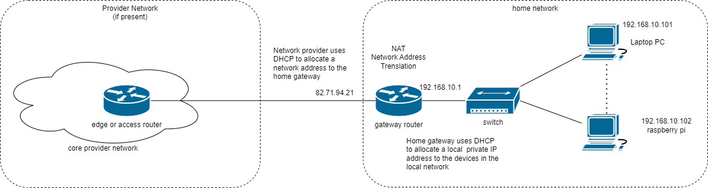
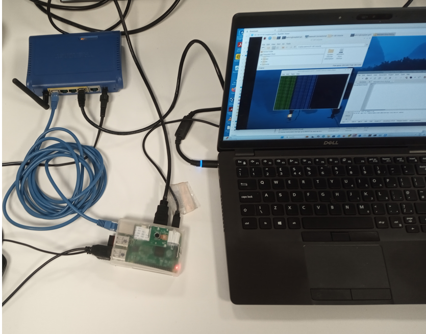
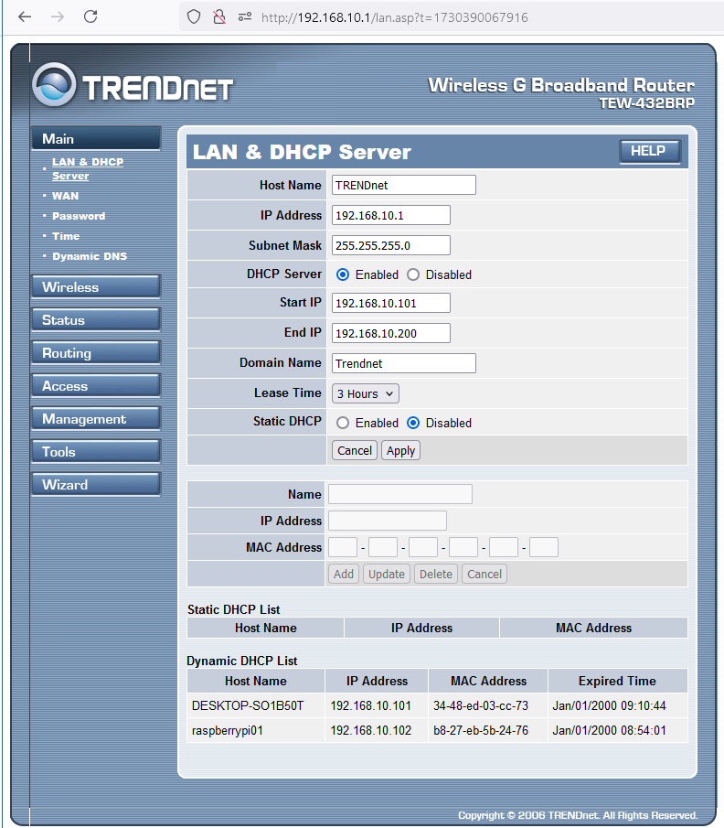
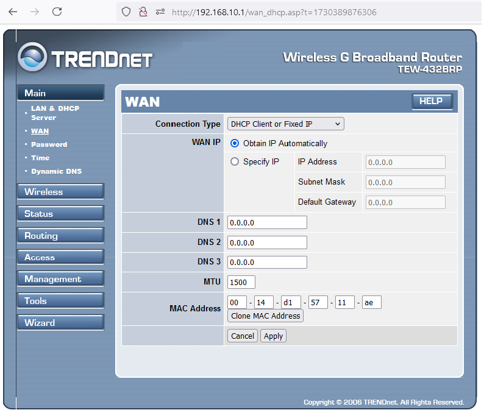

[Main Menu](../../README.md) | [session9](../../session9/) | [Networking Exercises](../docs/networking-exercises.md)

# Networking Exercises

#### Routing

We saw that IP packets traverse the network layer from end to end.
Routers typically have multiple ports each with a different IP address.
When a packet enters a router through one port, it uses a `routing table` to determine which port to use to forward the packet to its next destination.

These routing tables can be `statically` (manually) set up for small networks.
In larger networks, network routers use [routing protocols]https://en.wikipedia.org/wiki/Routing_protocol) such as OSPF (Open Shortest Path First) to exchange information so that each router's routing table will forward packets in the most optimum direction to get to towards their destination.

Routing Protocols are for a more advanced modules but we are going to look at the static routing tables used in a small Local Area Network such as is usually found in a home office.

The figure below shows a typical home network.


We can look at the current state of the interfaces on the raspberry Pi using the Linux command `ifconfig`.

```
dmin@raspberrypi01:~ $ ifconfig
eth0: flags=4163<UP,BROADCAST,RUNNING,MULTICAST>  mtu 1500
        inet 192.168.10.102  netmask 255.255.255.0  broadcast 192.168.10.255
        inet6 fe80::49f6:c909:a0ea:58c8  prefixlen 64  scopeid 0x20<link>
        ether b8:27:eb:5b:24:76  txqueuelen 1000  (Ethernet)
        RX packets 7702  bytes 724013 (707.0 KiB)
        RX errors 0  dropped 0  overruns 0  frame 0
        TX packets 8799  bytes 1529632 (1.4 MiB)
        TX errors 0  dropped 0 overruns 0  carrier 0  collisions 0

lo: flags=73<UP,LOOPBACK,RUNNING>  mtu 65536
        inet 127.0.0.1  netmask 255.0.0.0
        inet6 ::1  prefixlen 128  scopeid 0x10<host>
        loop  txqueuelen 1000  (Local Loopback)
        RX packets 30  bytes 3017 (2.9 KiB)
        RX errors 0  dropped 0  overruns 0  frame 0
        TX packets 30  bytes 3017 (2.9 KiB)
        TX errors 0  dropped 0 overruns 0  carrier 0  collisions 0

wlan0: flags=4163<UP,BROADCAST,RUNNING,MULTICAST>  mtu 1500
        inet 10.79.130.227  netmask 255.255.224.0  broadcast 10.79.159.255
        inet6 fe80::501:90a4:d59a:8134  prefixlen 64  scopeid 0x20<link>
        ether c8:d5:fe:00:ae:60  txqueuelen 1000  (Ethernet)
        RX packets 63  bytes 9634 (9.4 KiB)
        RX errors 0  dropped 0  overruns 0  frame 0
        TX packets 86  bytes 12215 (11.9 KiB)
        TX errors 0  dropped 0 overruns 0  carrier 0  collisions 0

```

Note that the Pi has two physical interfaces;  wired ethernet (eth0)  and wireless (wlan0).

`eth0` is the wired Ethernet interface which has a MAC address (ether `b8:27:eb:5b:24:76`) and an IP v4 address (inet `192.168.10.102`)

`wlan0` is the wireless interface (currently connected to eduroam) which has a MAC address (ether `c8:d5:fe:00:ae:60`) and an IP v4 address (inet `10.79.130.227`)

the lo interface is an internal `loopback` interface which always talks only to the local kernel. It has the address of `localhost` corresponding to `127.0.0.1`.

The pi has connections to two external networks : the local LAN which has an address range from `192.168.10.1` to `92.168.10.255`
and the wireless LAN which has a local address `10.79.130.227` and a gateway address `10.79.128.1`

We can look at the routing table on the raspberry pi using `ip route` or `route -n` which give us slightly different information.

```
admin@raspberrypi01:~ $ ip route 
default via 192.168.10.1 dev eth0 proto dhcp src 192.168.10.102 metric 100 
default via 10.79.128.1 dev wlan0 proto dhcp src 10.79.130.227 metric 600 
10.79.128.0/19 dev wlan0 proto kernel scope link src 10.79.130.227 metric 600 
192.168.10.0/24 dev eth0 proto kernel scope link src 192.168.10.102 metric 100 

admin@raspberrypi01:~ $ route -n
Kernel IP routing table
Destination     Gateway         Genmask         Flags Metric Ref    Use Iface
0.0.0.0         192.168.10.1    0.0.0.0         UG    100    0        0 eth0
0.0.0.0         10.79.128.1     0.0.0.0         UG    600    0        0 wlan0
10.79.128.0     0.0.0.0         255.255.224.0   U     600    0        0 wlan0
192.168.10.0    0.0.0.0         255.255.255.0   U     100    0        0 eth0
```

`ip route` tells us that both the eth0 and wlan0 IP addresses have been allocated by the router and the wifi gateway using `dhcp`.

In a simple network like this, the PC and the PI only need to know the address of a `default gateway` to talk to the Internet.

If the device does not have the destination in it's routing table, it will send it to the `default gateway` with the highest metric. 
In the table above, we can see that the Pi will prefer to use the eth0 wired connection before using the wlan0 connection as its gateway.
In or experiments this might not be correct because we know that only the wired network has connectivity to the internet using eduroam.

On the pi we could correct this by deleting the etho default route using

```
sudo ip route del default dev eth0
```


### PC Ethernet Config and Routing Table

We can also look at the ports on the PC using `ipconfig`  in powerShell

```
PS C:\Users\cg02r> ipconfig

Windows IP Configuration

Ethernet adapter Ethernet:

   Connection-specific DNS Suffix  . : Trendnet
   IPv4 Address. . . . . . . . . . . : 192.168.10.101
   Subnet Mask . . . . . . . . . . . : 255.255.255.0
   Default Gateway . . . . . . . . . : 192.168.10.1

Wireless LAN adapter Wi-Fi:

   Connection-specific DNS Suffix  . : solent.ac.uk
   Link-local IPv6 Address . . . . . : fe80::df7f:b9bb:e7b6:82df%21
   IPv4 Address. . . . . . . . . . . : 10.79.129.233
   Subnet Mask . . . . . . . . . . . : 255.255.224.0
   Default Gateway . . . . . . . . . : 10.79.128.1

```

And the routing table on the PC using the `route print` command in powerShell

```
PS C:\Users\cg02r> route print
===========================================================================
Interface List
 ...
 20...4c 1d 96 e1 b0 0a ......Microsoft Wi-Fi Direct Virtual Adapter
 19...34 48 ed 03 cc 73 ......Intel(R) Ethernet Connection (7) I219-LM
 ...

===========================================================================

IPv4 Route Table
===========================================================================
Active Routes:
Network Destination        Netmask          Gateway       Interface  Metric
          0.0.0.0          0.0.0.0     192.168.10.1   192.168.10.101     35
          0.0.0.0          0.0.0.0      10.79.128.1    10.79.129.233     35
      10.79.128.0    255.255.224.0         On-link     10.79.129.233    291
    10.79.129.233  255.255.255.255         On-link     10.79.129.233    291
...

===========================================================================

```

##### Exercise
The image below shows this network realised using a small home router, a PC and a Raspberry Pi.
See if you can make sense of the router's configuration.
This will be very similar to the configuration of your broadband router at home.










