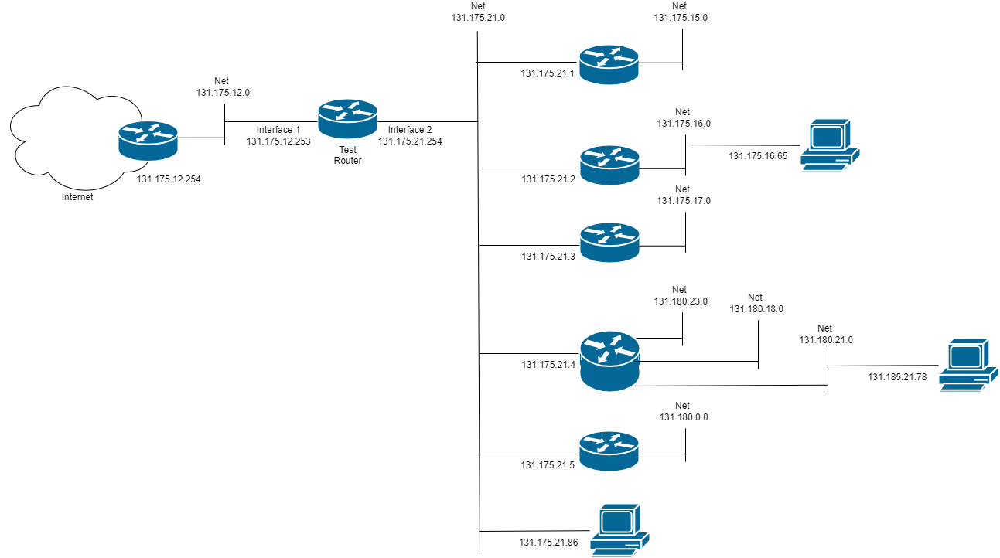

[Main Menu](../../README.md) | [session9](../../session9/) | [Routing Algorithms](../docs/routing-algorithms.md)

## Algorithm Used with Routing Table

Routers use internal `routing tables` to determine the next hop for incoming packets.

The following steps are used by the router to decide where to forward packets.

### 1. Check Direct Routing

First the router determines if this packet is destined for a directly connected network.

To perform this check, the router computes the 

Bitwise AND between each interfaces address and the interfaces netmask.

Then it performs a

Bitwise AND between the packet's destination address and the interface netmask.

If the two outcomes coincide, direct forwarding is performed on that interface.

For example, given the following interfaces

| interface | IP address  | Netmask       |Network (bitwise AND) |
|:----------|:------------|:--------------|:---------------------|
| eth0      |131.17.123.1 | 255.255.255.0 |131.17.123.0 |
| eth1      |131.17.78.1  | 255.255.255.0 |131.17.78.0 |
| eth2      |131.17.15.12 | 255.255.255.0 |131.17.15.0 |

Incoming packet 131.17.123.10 forwards to eth0.

|                        | IPv4 format  | Binary                             |
|:-----------------------|--------------|:-----------------------------------|
|Incoming packet Address |131.17.123.10 |10000011 00010001 01111011 00001010 |
|Netmask  (/24)          |255.255.255.0 |11111111 11111111 11111111 00000000 |
|                        |AND           |                                    |                    
|Network Address         |131.17.123.0  |10000011 00010001 01111011 00000000 |

|                        | IPv4 format  | Binary                             |
|:-----------------------|--------------|:-----------------------------------|
|eth0 interface address  |131.17.123.1  |10000011 00010001 01111011 00000001 |
|Netmask  (/24)          |255.255.255.0 |11111111 11111111 11111111 00000000 |
|                        |AND           |                                    |                    
|Network Address         |131.17.123.0  |10000011 00010001 01111011 00000000 |

Similarly incoming packet 131.17.78.30 forwards to eth1.

### 2. Check Indirect routing

If the direct routing check is negative for all the interfaces, indirect forwarding is performed using the routing table.

The very same check is performed for all the rows of the routing table using the corresponding netmask.

If the check is positive for multiple rows, the row with the highest number of 1s in its netmask is chosen (longest match). 
This means that we can specify an overlapping wide address range and a narrow address range.
The more specific narrow address range will be chosen in preference to the larger range.

This rule allows us to define a `default route` which will always be chosen if none of the other routes match.

`0.0.0.0` corresponds to the `default route` because the check is always positive but with a netmask length = 0

## Example Routes

Try working through the following routing table examples.
In each case find where to route an IP address coming from the Test Router.

A network diagram corresponding to the routing table is shown below.


### Example 1

Where to route 131.175.21.86

| Network     | Netmask      | first hop |   |
|:------------|:-------------|:----------|---|
|131.175.15.0 |255.255.255.0 |131.175.21.1| X  |
|131.175.16.0 |255.255.255.0 |131.175.21.2| X  |
|131.175.17.0 |255.255.255.0 |131.175.21.3| X  |
|131.180.23.0 |255.255.255.0 |131.175.21.4| X  |
|131.180.18.0 |255.255.255.0 |131.175.21.4| X  |
|131.180.21.0 |255.255.255.0 |131.175.21.4| X  |
|131.180.0.0  |255.255.0.0   |131.175.21.5| X  |
|0.0.0.0      |0.0.0.0       |131.175.12.254| X  |


| Interface     | IP Address   |  Netmask     |   |
|:--------------|:-------------|:-------------|---|
|interface 1:   |131.175.21.254| 255.255.255.0|YES  |
|interface 2:   |131.175.12.253| 255.255.255.0|X |

The packet is forwarded to interface 2.

### Example 2

Where to route 131.175.16.65

| Network     | Netmask      | first hop |   |
|:------------|:-------------|:----------|---|
|131.175.15.0 |255.255.255.0 |131.175.21.1| X  |
|131.175.16.0 |255.255.255.0 |131.175.21.2| OK - THIS ONE |
|131.175.17.0 |255.255.255.0 |131.175.21.3| X  |
|131.180.23.0 |255.255.255.0 |131.175.21.4| X  |
|131.180.18.0 |255.255.255.0 |131.175.21.4| X  |
|131.180.21.0 |255.255.255.0 |131.175.21.4| X  |
|131.180.0.0  |255.255.0.0   |131.175.21.5| X  |
|0.0.0.0      |0.0.0.0       |131.175.12.254| OK |


| Interface     | IP Address   |  Netmask     |   |
|:--------------|:-------------|:-------------|---|
|interface 1:   |131.175.21.254| 255.255.255.0|   |
|interface 2:   |131.175.12.253| 255.255.255.0|   |

The packet is forwarded to the first matching router 131.175.21.2 which can be reached on interface 1.

### Example 3

Where to route 131.180.21.78

| Network     | Netmask      | first hop |   |
|:------------|:-------------|:----------|---|
|131.175.15.0 |255.255.255.0 |131.175.21.1| X  |
|131.175.16.0 |255.255.255.0 |131.175.21.2| X |
|131.175.17.0 |255.255.255.0 |131.175.21.3| X  |
|131.180.23.0 |255.255.255.0 |131.175.21.4| X  |
|131.180.18.0 |255.255.255.0 |131.175.21.4| X  |
|131.180.21.0 |255.255.255.0 |131.175.21.4| OK - THIS ONE |
|131.180.0.0  |255.255.0.0   |131.175.21.5| OK  |
|0.0.0.0      |0.0.0.0       |131.175.12.254| OK |


| Interface     | IP Address   | Netmask      |   |
|:--------------|:-------------|:-------------|---|
|interface 1:   |131.175.21.254| 255.255.255.0|   |
|interface 2:   |131.175.12.253| 255.255.255.0|   |

In this case, there are three possibl matches but because the subnet mask is longest for 131.175.21.4, it is preferred.

examples taken from (https://www.lri.fr/~fmartignon/documenti/reseaux/3-RoutingForwarding-Martignon.pdf)


# Example real routing table

Real routing tables combine interface data with other metrics to ontrol the choice of route. 

`route -n` is a common command to show routes in a Linux system.

```
route -n
Kernel IP routing table
Destination     Gateway         Genmask         Flags Metric Ref    Use Iface
0.0.0.0         192.168.10.1    0.0.0.0         UG    100    0        0 eth0
0.0.0.0         10.79.128.1     0.0.0.0         UG    600    0        0 wlan0
10.79.128.0     0.0.0.0         255.255.224.0   U     600    0        0 wlan0
192.168.10.0    0.0.0.0         255.255.255.0   U     100    0        0 eth0
```

In this case we can see each entry has a destination, gateway and mask as described above.

Interfaces also have a `metric`. 
A lower metric number makes the system prefer a route over an equivalent route with a hugher metric.
So in this case we can see that if the wired `eth0` is connected, it will be preferred as the default route over the wireless `wlan0`.

The Flag `U` means that the interface is UP. 
The flag `G` means that this is a Gateway


