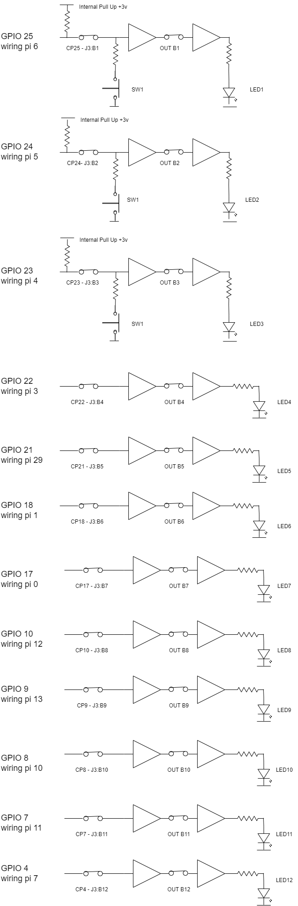

[session3](../../session3/) | [Intro to Gertboard and Wiring Pi](../docs/gertboard-wiringpi-intro.md)

# Intro to Gertboard and WiringPi

The Gertboard is a pre-assembled digital input output (IO) board designed for experiments with the Raspberry Pi. 
WiringPi is a software library which we can use to manipulate circuits implemented using the Gertboard.

## Gertboard

The Gertboard provides a lot of different IO options including analogue and digital inputs and outputs and drivers for high power relays.
However for this Module, we will only look at simple digital inputs and outputs.

A full toolkit of software and examples are provided by the designers of the board, which are linked below.
These are provided for reference and further investigation if you wish, but in this module, we will use a more simplified approach using WiringPi.

| local file              |reference link              | notes                   |
|:------------------------|:------------------------|:------------------------|
| GertBoard c software github |  https://github.com/ChrisCummins/gertboard_sw/tree/master   | Software supplied to use with Gertboard (Does not use WiringPi) |
| [assembled_gertboard_schematics.pdf](../docs/assembled_gertboard_schematics.pdf)  | [assembled_gertboard_schematics - reference](https://www.openhacks.com/uploadsproductos/assembled_gertboard_schematics.pdf) | detailed design schematics of Gertboard   |
|  [gertboardusermanual.pdf](../docs/gertboardusermanual.pdf)  |  [gertboardusermanual.pdf](https://www.farnell.com/datasheets/1683444.pdf)  | full user manual to use with software  |
|  [GertBoardOverview-1600404.pdf](../docs/GertBoardOverview-1600404.pdf)  | [Gertboard overview](https://www.farnell.com/datasheets/1600404.pdf)    | overview of Gertboard          |
|                        |  [raspberry pi pinout reference](https://pinout.xyz/)   |           |

### simplified Gertboard setup

We will use the same Gertboard setup for all of our experiments which wires up three push buttons as inputs to the Pi and 9 Red LEDs as outputs.

The circuit wired on the Gertboard is shown below. 

   
   
The LED's are driven by the buffer circuits which allow more power to light each LED than the Pi itself could provide. 

For each of the three buttons, the GPIO chip must be configured to provide an internal `pull up` which makes the input `1` unless the button is pressed.

### Setting up wiring links for board

To set up the Gertboard to implement the circuit above, you need to apply the following links.

Jumper Power Link 3.3v (beside J4)

   
   
Jumper Links and Wire Links

   

|Jumper Links |
|:-------------------|
|OUT B1 ,B2, B3, B4 |
|OUT B5 ,B6, B7, B8 |
|OUT B9 ,B10, B11, B12 |

   
Wire links between GP pins and J2
   
| pi GPIO    | J2    |     |
|:---------- |:----- |:--- |
|GP25        |B1     |     |
|GP24        |B2     |     |
|GP23        |B3     |     |
|GP22        |B4     |     |
|GP21        |B5     |     |
|            |       | no Pi pin GP20    |
|GP18        |B6     |     |
|GP17        |B7     |     |
|            |       | no Pi pin GP16    |
|GP15        |B8     |     |
|GP14        |B9     |     |
|            |       | no Pi pin GP13    |
|            |       | no Pi pin GP12    |
|GP11        |B10    |     |
|GP10        |B11    |     |
|GP9         |B12    |     |
|GP8         |       |     |
|GP7         |       |     |
|            |       | no Pi pin GP6    |
|            |       | no Pi pin GP5    |
|GP4         |       |     |
|            |       | no Pi pin GP3    |
|            |       | no Pi pin GP2    |
|GP1         |       |     |
|GP0         |       |     |

