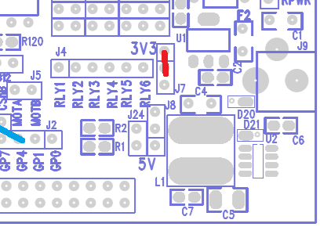
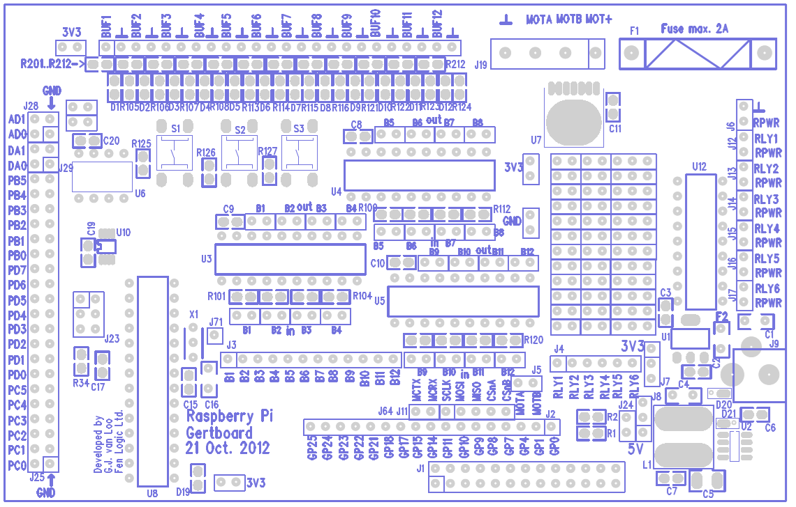

[session3](../../session3/) | [Intro to Gertboard and Wiring Pi](../docs/gertboard-wiringpi-intro.md)

# Intro to Gertboard and Wiring Pi

## gertboard

| local file              |reference link              | notes                   |
|:------------------------|:------------------------|:------------------------|
| GertBoard c software github |  https://github.com/ChrisCummins/gertboard_sw/tree/master   |  |
| [assembled_gertboard_schematics.pdf](../docs/assembledassembled_gertboard_schematics.pdf)  | [assembled_gertboard_schematics - reference](https://www.openhacks.com/uploadsproductos/assembled_gertboard_schematics.pdf) |    |
|  [gertboardusermanual.pdf](../docs/gertboardusermanual.pdf)  |  [gertboardusermanual.pdf](https://www.farnell.com/datasheets/1683444.pdf)                        |           |
|  [GertBoardOverview-1600404.pdf](../docs/GertBoardOverview-1600404.pdf)  | [gertboard overview](https://www.farnell.com/datasheets/1600404.pdf)    |           |
|                        |                          |           |

## Setting up wiring links for board

Jumper Power Link 3.3v (beside J4)

   
   
Jumper Links and Wire Links

   

|Jumper Links |
|:-------------------|
|OUT B1 ,B2, B3, B4 |
|OUT B5 ,B6, B7, B8 |
|OUT B9 ,B10, B11, B12 |

   
Wire links between GP pins and J2
   
| pi GPIO    | J2    |     |
|:---------- |:----- |:--- |
|GP25        |B1     |     |
|GP24        |B1     |     |
|GP23        |B1     |     |
|GP22        |B1     |     |
|GP21        |B1     |     |
|            |       | no Pi pin GP20    |
|GP18        |B1     |     |
|GP17        |B1     |     |
|            |       | no Pi pin GP16    |
|GP15        |B1     |     |
|GP14        |B1     |     |
|            |       | no Pi pin GP13    |
|            |       | no Pi pin GP12    |
|GP11        |B1     |     |
|GP10        |B1     |     |
|GP9         |B1     |     |
|GP8         |B1     |     |
|GP7         |B1     |     |
|            |       | no Pi pin GP6    |
|            |       | no Pi pin GP5    |
|GP4         |B1     |     |
|            |       | no Pi pin GP3    |
|            |       | no Pi pin GP2    |
|GP1         |B1     |     |
|GP0         |B1     |     |
