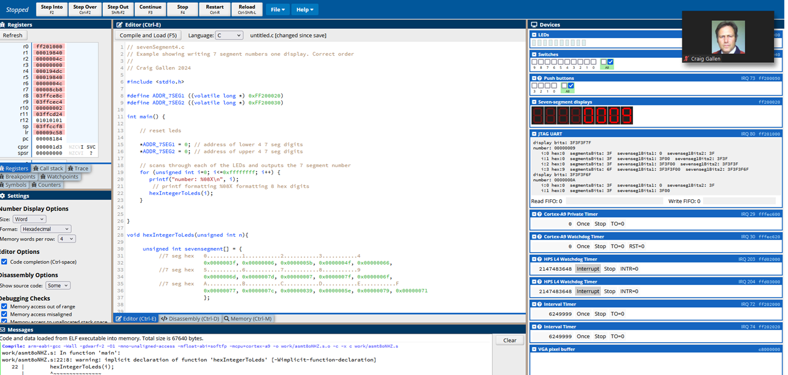

[sevenSegment1.c](../sevensegment/code/sevenSegment1.c)

[sevenSegment2.c](../sevensegment/code/sevenSegment2.c)

[sevenSegment3.c](../sevensegment/code/sevenSegment3.c)

[sevenSegment4.c](../sevensegment/code/sevenSegment4.c)

[sevenSegment4.c](../sevensegment/code/sevenSegment4.c)

   