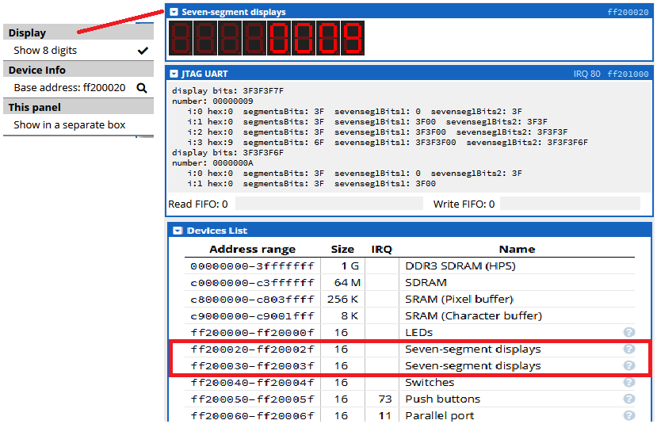

[Main Menu](../../sessions/README.md) | [session6](../../session6/) | [Seven Segment Display Examples](../sevensegment/sevenSegmentDisplayExamples.md)

# Seven Segment Display Examples

In this exercise we will continue our exploration of manipulating hardware devices by looking at the 7 segment displays on the CPULator.

Seven Segment displays are a technology which can display numerics and symbols using just seven LEDs.
You can see more about symbol mapping in the [Wikipedia 7 segment displays article](https://en.wikipedia.org/wiki/Seven-segment_display)

In the CPUlator, there are 8 separate seven segment displays controlled by two 32 bit registers.

   
   
The displays are controlled by 2 registers located at the following addresses:

```
0xFF200020
0xFF200030
```

Below are links for documentation on the displays 

[7 segment display documentation - Uni Toronto](https://www-ug.eecg.utoronto.ca/desl/nios_devices_SoC/ARM/dev_7segs.html)

[7 segment display manufacturers documentation CPUlator](https://fpgacademy.org/Downloads/DE1-SoC_Computer_ARM.pdf#subsubsection.2.9.2)

## Exercise 1

In this first assembler program, we write to the two registers so that the lowest digit displays `1` and the upper digits are all turned off.

Try compiling the assembler program [simple7seg1.s](../sevensegment/code/simple7seg1.s) by pasting the program into the Editor panel, selecting `ARM7`, and pressing `compile`.

You will see the disassembled code.

Now press `continue` and the led displays should display `1`

You now need to work out which bits in the register control which display segments.

You then need to create a table which maps all of the hex symbols 0,1,2,3,4,5,6,7,8,9,a,b,c,d,e,f onto their equivalent 8 bit byte which will drive the 7 segment display

| hex number | display bits


### One 1
```
0b0000110 (0x06)

    |
    |

```


[simple7seg2.s](../sevensegment/code/simple7seg2.s)


[simple7seg2.s](../sevensegment/code/simple7seg2.s)


[sevenSegment1.c](../sevensegment/code/sevenSegment1.c)

[sevenSegment2.c](../sevensegment/code/sevenSegment2.c)

[sevenSegment3.c](../sevensegment/code/sevenSegment3.c)

[sevenSegment4.c](../sevensegment/code/sevenSegment4.c)

[sevenSegment4.c](../sevensegment/code/sevenSegment4.c)


   