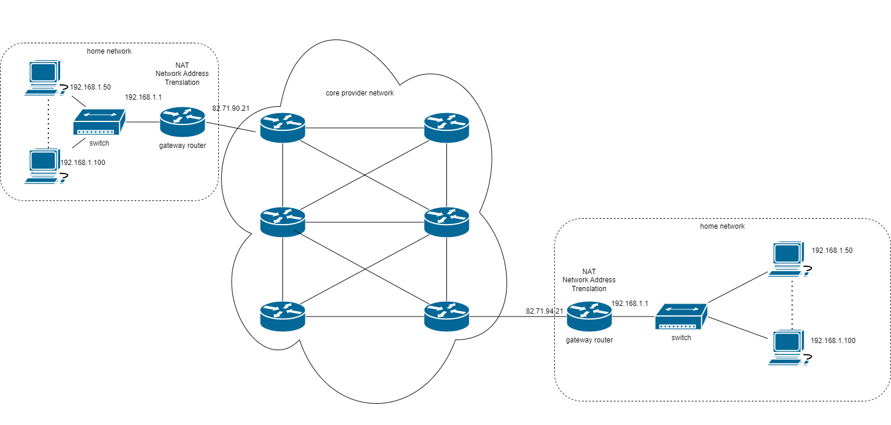
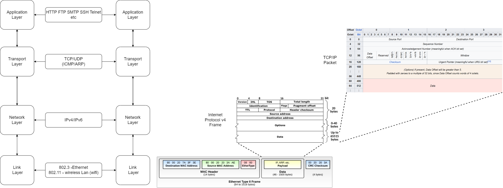
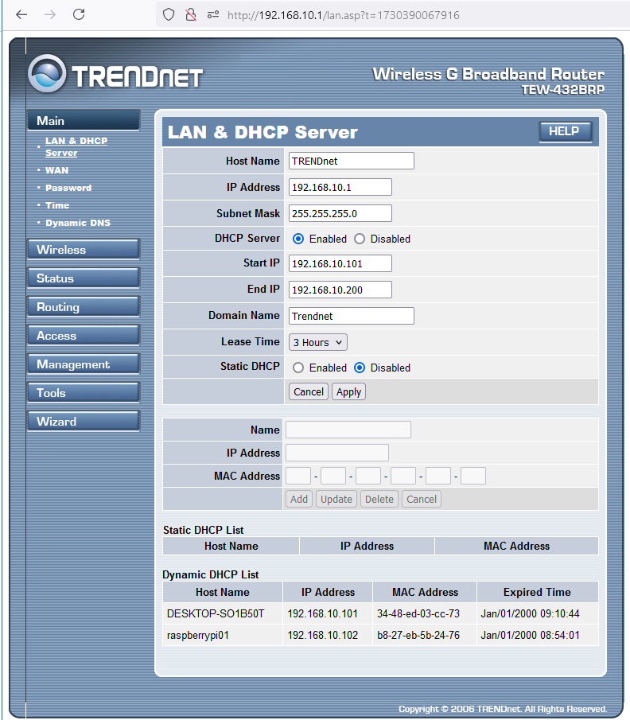

[Main Menu](../../README.md) | [session9](../../session9/) | [Introduction to Networking](../docs/introduction-to-networking.md)

# Introduction to Networking

In this section we will give a basic introduction to `networking`, that is, how computers and devices communicate with each other over the Internet.

`Routers` are devices in a network which collaborate to `route` packets from from router to router across the network to their final destination.

The diagram below illustrates how domestic gateway routers connect to a core `provider network` which carries communications to another part of the network.



In this section we will give a simple introduction to IP networking by concentrating on what happens in a small office or home network at the edge of the Internet.
This will introduce the basic principles but will leave a full discussion of enterprise networking to a later networking course.

## Network protocol layers

Over the years there have been many networking technologies which have been standardised, widely adopted and later superseded by something better (e.g. Fibre, Frame Relay, ISDN, ATM, ADSL, Wifi, Dial up modems etc).
Engineers have found it useful to describe each of these technologies in terms of `network layers` starting with the  physical medium (Wireless, Electrical cables, Light) and rising to the application using the network (Web Browser, file transfer, video audio etc). 

A `network protocol` is a set of conventions governing the treatment and especially the formatting of data in an electronic communications system.
Each network layer has its own `protocol` and in a well designed system, it should be possible to substitute one protocol in a given layer for another protocol in he same layer without the layers above or below noticing the change or needing to be changed.

As an example, your computer could connect to a wired `ethernet` network or to a wireless `wifi` network and apart from a change of IP address, the applications using the network connection will all continue to work the same way.

The most comprehensive model used for describing networks is the [OSI 7 Layer Model](https://en.wikipedia.org/wiki/OSI_model) but we will simplify this to just 4 layers in the following diagram which also shows the data formats used in each layer.



References : 
[TCP (Wikipedia)](https://en.wikipedia.org/wiki/Transmission_Control_Protocol), 
[IPv4 (Wikipedia)](https://en.wikipedia.org/wiki/IPv4), 
[Ethernet (Wikipedia)](https://en.wikipedia.org/wiki/Ethernet_frame)

### The Link Layer (OSI layer 2)

The link layer is used for local point to point communications where the communicating devices send signals directly between each other.

#### RS232 Serial Point to Point
One of the earliest and simplest link layer protocols (called [RS232](https://en.wikipedia.org/wiki/RS-232)) uses a serial cable between the two devices. 
This might connect a computer to a [dial up modem](https://en.wikipedia.org/wiki/Dial-up_Internet_access) or a [serial terminal](https://en.wikipedia.org/wiki/Computer_terminal).

All network communication is performed by sending a series of bytes serially as binary `1` or `0` symbols in a series of `frames` 
The `link layer` translates these signals into a form which can be transmitted across a `medium` which could be cable (RS232/Ethernet/ADSL), Air (wireless/wifi) or light (fibre).

Earlier we played with a simulated UART to print characters to a serial terminal.
A UART will typically enable RS232 communication.

A UART is a very simple link layer device where each frame contains is a single byte of data. 


The frame has `start` and `stop` bits and includes a single bit `parity checksum` which checks if there are an odd or even number of 1's in the data byte.
When the frame is received, the checksum is recalculated and if the bit doesn't match, the frame is discarded.
See [how a UART works](https://www.rohde-schwarz.com/uk/products/test-and-measurement/essentials-test-equipment/digital-oscilloscopes/understanding-uart_254524.html)

#### Ethernet

Normally RS232 can only connect two devices but later link layer protocols can connect multiple devices on the same `network segment`.

[Ethernet](https://en.wikipedia.org/wiki/Ethernet) is a widely used standard where all of the devices in the same segment listen to all of the messages transmitted to the segment and select the messages messages which are addressed to themselves.

Early Ethernet networks used a single co-axial cable ([10bse5](https://www.mattmillman.com/projects/10base5/)) to connect all of the devices in the same segment.
Devices could send messages at at any time so it was possible that two devices would send at the same time and the messages would collide. 
(Hence another name for the Ethernet protocol was `CSMA-CD - Carrier Sense Multiple Access - Collision Detect)
However provided the network was less than 30% occupied, most of the messages would get through.

Today, most Ethernet networks use separate [Category 5 twisted pair cables](https://en.wikipedia.org/wiki/Category_5_cable) to connect each of the devices to a  common`layer 2 switch` or `hub`.
Unlike a passive coaxial cable, the switch is a single point of failure but it can increase throughput by avoiding collisions.


Ethernet uses a `Media Access Control (MAC) Protocol` which describes the messages sent on an Ethernet segment.
The MAC protocol describes a link layer frame of up to 1518 bytes. 

Every device on an Ethernet segment has netowrk ports implemented by (Network Interface Cards (NICs).
Each NIC has a unique `Media Access Control (MAC) address` which is used by the receiving device to tell whether the message is for itself.
The `MAC Address` is often set by the NIC manufacturer and should be globally unique or at least unique within the segment.

When a device transmits a frame, it includes its own MAC address, the `source MAC address`, and the `destination MAC address` of the device it wants to talk to.

The frame also contains up to 1500 bytes of data and a 4 byte `checksum`.
The `checksum` is calculated using an algorithm which scans all of the data bytes in the frame. 
When a frame is received, the receiver also calculates the checksum and if the received checksum doesn't match the transmitted checksum, there is an error in transmission and the whole frame is discarded.

### Network Layer (OSI layer 3)

The `network layer` is used to communicate across a network consisting of multiple `link layer` segments.
This is illustrated in the network diagram at the beginning of this section.

Frames generated by the `network layer` form the `payload` of `link layer frames`. 
Sometimes the network layer frames (or `packets`) are too big for the link layer, in which case they are `fragmented` and joined back to together by the link layer.

#### Internet Addresses

The Internet V4 protocol defines a 32 bit IP address for each device in the network. 
Each network layer frame has a `source IP address` and a `destination IP address` which is used by the network layer to deliver the frame to the correct device. 

IPv4 addresses consist of 4 bytes which are typically written as 4 decimal numbers separated by full stops. 

Each number has a range from 0 to 255. e.g. `192.168.0.1` represents binary`11000000 10101000 00000000 00000001` or hex `0xC0A80001`

The original Internet design (IPv4) assumed 32 bits were enough to cover the projected number of computers in the world (4.3 billion addresses available).
Internet addresses are allocated globally by the Internet Assigned Numbers Authority (IANA) which announced that the available address allocations began to be exhausted on 31 January 2011 (see [IPv4_address_exhaustion](https://en.wikipedia.org/wiki/IPv4_address_exhaustion))

Fortunately, IPv6 is being introduced which has a much larger address range.
An IPv6 address has 128-bits and is usually written in hex e.g. `2001:db8:3333:4444:5555:6666:7777:8888`

There are 340 undecillion (2128 or 3.4×1038) possible IPv6 addresses, which is more than 100 times the number of atoms on Earth. 
This means that there is enough space for trillions of Internet devices for the foreseeable future.

(We will just look at IPv4 for now).

#### Address Resolution

We have seen that every NIC connected to a `link layer` segment has a fixed `MAC address` for each of its ports.
This uniquely identifies the physical device.

To communicate through the `network layer`, each device device is also given an IP address.

The [Address Resolution Protocol (ARP)](https://en.wikipedia.org/wiki/Address_Resolution_Protocol) is used to allow  devices to discover what other devices are in their segment and what their IP addresses are. 
When a host wants to send a packet to another host, say IP address 10.5.5.1, on its local area network (LAN), it first sends out (broadcasts) an ARP packet. The ARP packet contains a simple question: What is the MAC address corresponding to IP address 10.5.5.1? The host that has been configured to use the IP address responds with an ARP packet containing its MAC address.
This allows the device to build up an `ARP Table` which maps IP addresses reachable on the local network to the associated MAC Address of the NIC.

#### Exercise - look at the ARP tables for your device

On windows, open a power shell and type `arp -a`

```
PS C:\Users\cg02r> arp -a

Interface: 192.168.10.101 --- 0x12
  Internet Address      Physical Address      Type
  192.168.10.1          00-14-d1-57-11-ad     dynamic
  192.168.10.102        b8-27-eb-5b-24-76     dynamic
  192.168.10.255        ff-ff-ff-ff-ff-ff     static
  224.0.0.22            01-00-5e-00-00-16     static
  224.0.0.251           01-00-5e-00-00-fb     static
  224.0.0.252           01-00-5e-00-00-fc     static
  239.192.152.143       01-00-5e-40-98-8f     static
  239.255.255.250       01-00-5e-7f-ff-fa     static
  255.255.255.255       ff-ff-ff-ff-ff-ff     static
```

On a Raspberry pi try `arp -a` or `arp`

```
admin@raspberrypi01:~ $ arp -a
wstaff-79-128-1.solent.ac.uk (10.79.128.1) at b4:0c:25:e2:80:10 [ether] on wlan0
192-168-x-x.solent.ac.uk (192.168.10.1) at 00:14:d1:57:11:ad [ether] on eth0
192-168-x-x.solent.ac.uk (192.168.10.101) at 34:48:ed:03:cc:73 [ether] on eth0
```

```
admin@raspberrypi01:~ $ arp
Address                  HWtype  HWaddress           Flags Mask            Iface
wstaff-79-128-1.solent.  ether   b4:0c:25:e2:80:10   C                     wlan0
192-168-x-x.solent.ac.u  ether   00:14:d1:57:11:ad   C                     eth0
192-168-x-x.solent.ac.u  ether   34:48:ed:03:cc:73   C                     eth0
admin@raspberrypi01:~ $ ^C
admin@raspberrypi01:~ $ 

```

#### Address Allocation (DHCP)

Devices can be manually allocated `static IP addresses`, but it usually more convenient to automatically allocate an IP address to a device when it is connected to the network.
This is done using the [Dynamic Host Configuration Protocol (DHCP)](https://en.wikipedia.org/wiki/Dynamic_Host_Configuration_Protocol).

When a device connects to the network, it broadcasts a `DHCP Request` and any `DHCP Server` on the network will supply the device with the next available IP address from the pool of DHCP addresses.

#### Routing

We saw that IP packets traverse the network layer from end to end.
Routers typically have multiple ports each with a different IP address.
When a packet enters a router through one port, it uses a `routing table` to determine which port to use to forward the packet to its next destination.

These routing tables can be `statically` (manually) set up  for small networks but in larger networks, network routers use [routing protocols]https://en.wikipedia.org/wiki/Routing_protocol) such as OSPF (Open Shortest Path First) to exchange information to put in the routing tables about how to get to a remote destination. 

Routing Protocols are for a more advanced modules but we are going to look at the static routing tables used in a small Local Area Network such as is usually found in a home office.

The figure below shows a typical home network.


We can look at the current state of the interfaces on the raspberry Pi using `ifconfig`.

```
dmin@raspberrypi01:~ $ ifconfig
eth0: flags=4163<UP,BROADCAST,RUNNING,MULTICAST>  mtu 1500
        inet 192.168.10.102  netmask 255.255.255.0  broadcast 192.168.10.255
        inet6 fe80::49f6:c909:a0ea:58c8  prefixlen 64  scopeid 0x20<link>
        ether b8:27:eb:5b:24:76  txqueuelen 1000  (Ethernet)
        RX packets 7702  bytes 724013 (707.0 KiB)
        RX errors 0  dropped 0  overruns 0  frame 0
        TX packets 8799  bytes 1529632 (1.4 MiB)
        TX errors 0  dropped 0 overruns 0  carrier 0  collisions 0

lo: flags=73<UP,LOOPBACK,RUNNING>  mtu 65536
        inet 127.0.0.1  netmask 255.0.0.0
        inet6 ::1  prefixlen 128  scopeid 0x10<host>
        loop  txqueuelen 1000  (Local Loopback)
        RX packets 30  bytes 3017 (2.9 KiB)
        RX errors 0  dropped 0  overruns 0  frame 0
        TX packets 30  bytes 3017 (2.9 KiB)
        TX errors 0  dropped 0 overruns 0  carrier 0  collisions 0

wlan0: flags=4163<UP,BROADCAST,RUNNING,MULTICAST>  mtu 1500
        inet 10.79.130.227  netmask 255.255.224.0  broadcast 10.79.159.255
        inet6 fe80::501:90a4:d59a:8134  prefixlen 64  scopeid 0x20<link>
        ether c8:d5:fe:00:ae:60  txqueuelen 1000  (Ethernet)
        RX packets 63  bytes 9634 (9.4 KiB)
        RX errors 0  dropped 0  overruns 0  frame 0
        TX packets 86  bytes 12215 (11.9 KiB)
        TX errors 0  dropped 0 overruns 0  carrier 0  collisions 0

```
eth0 is the wired Ethernet interface which has a MAC address (ether b8:27:eb:5b:24:76) and an IP v4 address (inet 192.168.10.102)

wlan0 is the wireless interface (currently connected to eduroam) which has a MAC address (ether c8:d5:fe:00:ae:60) and an IP v4 address (inet 10.79.130.227)

the lo interface is an internal `loopback` interface which always talks only to the local kernel. It has the address of `localhost` 127.0.0.1.

The pi has connections to two external networks : the local LAN which has an address range from 192.168.10.1 to 92.168.10.255
and the wireless LAN which has a local address `10.79.130.227` and a gateway address `10.79.128.1`

We can look at the routing table on the raspberry pi using `ip route` or `route -n` which give us slightly different information.

```
admin@raspberrypi01:~ $ ip route 
default via 192.168.10.1 dev eth0 proto dhcp src 192.168.10.102 metric 100 
default via 10.79.128.1 dev wlan0 proto dhcp src 10.79.130.227 metric 600 
10.79.128.0/19 dev wlan0 proto kernel scope link src 10.79.130.227 metric 600 
192.168.10.0/24 dev eth0 proto kernel scope link src 192.168.10.102 metric 100 

admin@raspberrypi01:~ $ route -n
Kernel IP routing table
Destination     Gateway         Genmask         Flags Metric Ref    Use Iface
0.0.0.0         192.168.10.1    0.0.0.0         UG    100    0        0 eth0
0.0.0.0         10.79.128.1     0.0.0.0         UG    600    0        0 wlan0
10.79.128.0     0.0.0.0         255.255.224.0   U     600    0        0 wlan0
192.168.10.0    0.0.0.0         255.255.255.0   U     100    0        0 eth0
```

`ip route` tells us that both the eth0 and wlan0 IP addresses have been allocated by the router and the wifi gateway using `dhcp`.

In a simple network like this, the PC and the PI only need to know the address of a `default gateway` to talk to the Internet.

If the device does not have the destination in it's routing table, it will send it to the `default gateway` with the highest metric. 
In the table above, we can see that the Pi will prefer to use the eth0 wired connection before using the wlan0 connection as its gateway.


Note that the Pi has two interfaces wired ethernet (eth0) with IP address  and wireless (wlan0)

### PC Ethernet Config and Routing Table

We can also look at the ports on the PC using `ipconfig`  in powerShell

```
PS C:\Users\cg02r> ipconfig

Windows IP Configuration

Ethernet adapter Ethernet:

   Connection-specific DNS Suffix  . : Trendnet
   IPv4 Address. . . . . . . . . . . : 192.168.10.101
   Subnet Mask . . . . . . . . . . . : 255.255.255.0
   Default Gateway . . . . . . . . . : 192.168.10.1

Wireless LAN adapter Wi-Fi:

   Connection-specific DNS Suffix  . : solent.ac.uk
   Link-local IPv6 Address . . . . . : fe80::df7f:b9bb:e7b6:82df%21
   IPv4 Address. . . . . . . . . . . : 10.79.129.233
   Subnet Mask . . . . . . . . . . . : 255.255.224.0
   Default Gateway . . . . . . . . . : 10.79.128.1

```

And the routing table on the PC using the `route print` command in powerShell

```
PS C:\Users\cg02r> route print
===========================================================================
Interface List
 ...
 20...4c 1d 96 e1 b0 0a ......Microsoft Wi-Fi Direct Virtual Adapter
 19...34 48 ed 03 cc 73 ......Intel(R) Ethernet Connection (7) I219-LM
 ...

===========================================================================

IPv4 Route Table
===========================================================================
Active Routes:
Network Destination        Netmask          Gateway       Interface  Metric
          0.0.0.0          0.0.0.0     192.168.10.1   192.168.10.101     35
          0.0.0.0          0.0.0.0      10.79.128.1    10.79.129.233     35
      10.79.128.0    255.255.224.0         On-link     10.79.129.233    291
    10.79.129.233  255.255.255.255         On-link     10.79.129.233    291
...

===========================================================================

```


##### Exercise
The image below shows this network realised using a small home router, a PC and a Raspberry Pi





# notes


physical layer - Mac addresses
IP layer - Ip addresses

TCP/UDP  ports
NAT

finding other devices on the netowrk -ARP

routing tables
routing protocols

DNS - translating IP addresses to

https://www.calculator.net/ip-subnet-calculator.html?cclass=any&csubnet=19&cip=10.79.128.1&ctype=ipv4&x=Calculate

on windows terminal try 

https://superuser.com/questions/29640/inverse-arp-lookup

https://www.networkworld.com/article/969445/checking-network-connections-with-arp-and-ip-neigh.html
